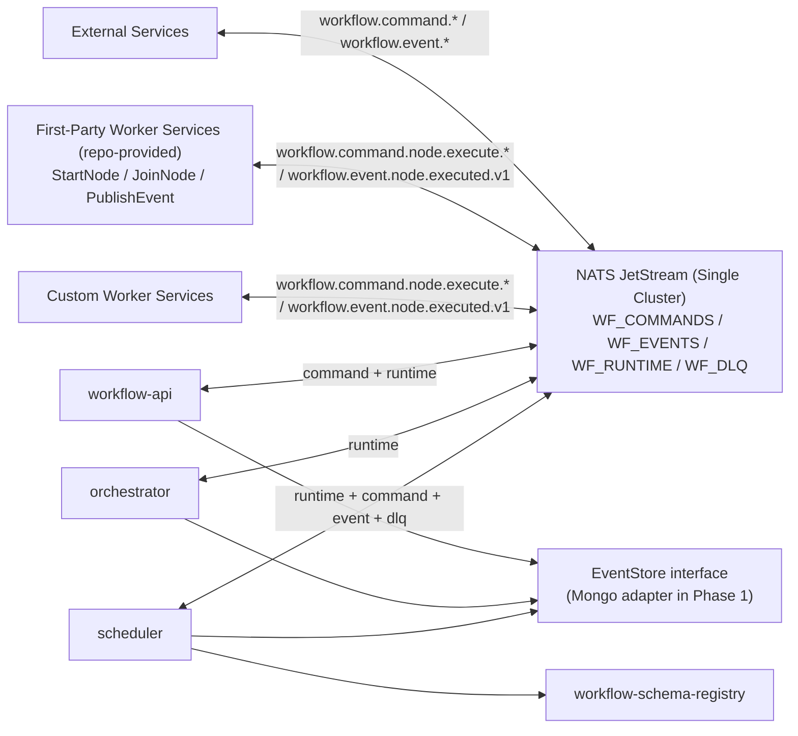
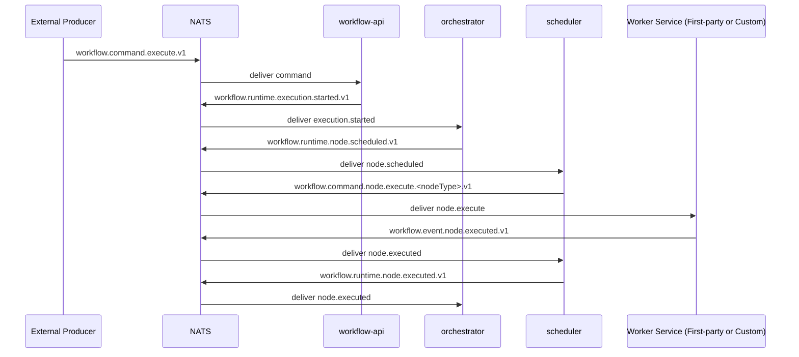
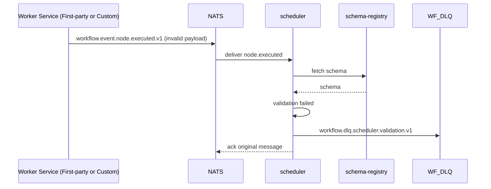

# Workflow Engine Technical Design (Workflow-Centric, Messaging v2)

## 1. Overview

This document defines a workflow-centric technical design by consolidating:

- existing workflow orchestration design in `technical-design.md`
- YAML workflow modeling rules in `workflow-dsl.md`
- the latest messaging architecture decisions in `2026-03-04-workflow-messaging-architecture-design.md`

The system focuses on orchestration, not worker business logic. It executes DAG workflows, supports conditional routing and join synchronization, and integrates external services through a versioned event contract.

Built-in node types are not executed as privileged in-process logic. They run as worker services using the same dispatch/result contract as custom workers. These built-in worker services are provided by this repository and must be started to execute their corresponding node types.

## 2. Goals and Non-Goals

### 2.1 Goals

- Execute DAG-based workflows reliably.
- Keep orchestration concerns isolated from worker implementation concerns.
- Standardize workflow definition through YAML DSL.
- Provide a stable, versioned messaging contract for internal coordination and external integration.
- Support schema validation, idempotency, and dead-letter handling by default.

### 2.2 Non-Goals

- Embedded in-process node execution paths that bypass scheduler/worker contracts.
- Visual workflow editor implementation.
- Full multi-tenant data isolation design in this phase.

## 3. High-Level Architecture



### 3.1 Component Responsibilities

| Component | Responsibility |
|---|---|
| `workflow-api` | Workflow CRUD and execution entrypoint. Converts REST or command events into runtime execution-start events. |
| `orchestrator` | DAG traversal and execution state progression. Decides next nodes and emits schedule events. |
| `scheduler` | Converts schedule events into worker dispatch commands. Validates node-result schemas and returns execution results to orchestrator. |
| `first-party worker services` | Worker implementations shipped by this repository for built-in node types. Must be deployed/running to execute those node types. |
| `workflow-schema-registry` | Versioned schema lookup for event payload validation. |
| `EventStore` | Persistent event/audit and dedup record abstraction. |

## 4. Workflow Domain Model

The workflow model remains the canonical runtime structure.

```go
type Workflow struct {
    ID          string
    Nodes       []Node
    Connections []Connection
}

type Node struct {
    ID         string
    Type       NodeType
    Name       string
    Parameters map[string]any
    Trigger    *Trigger // optional, mainly for StartNode
}

type Connection struct {
    FromNode string
    FromPort string // optional, default: "default"
    ToNode   string
    ToPort   string // optional, used by JoinNode
}
```

### 4.1 Node Type Categories

| Category | Type | Purpose |
|---|---|---|
| Built-in worker node (first-party) | `StartNode` | Workflow entrypoint behavior executed by a repo-provided worker service. |
| Built-in worker node (first-party) | `JoinNode` | Fan-in continuation behavior executed by a repo-provided worker service. |
| Built-in worker node (first-party) | `PublishEvent` | Domain event publish behavior executed by a repo-provided worker service. |
| Custom worker node | `<node_type>@<version>` | Executed by custom worker services using the same worker protocol. |

Runtime normalization rule:

- Subject naming uses normalized lowercase node identifiers in dispatch subjects (for example `start-node`, `join-node`, `publish-event`).

## 5. Workflow YAML DSL

### 5.1 Top-Level Structure

```yaml
id: <workflow-id>
name: <display-name>
description: <text>
version: <semver>

nodes:
  - <node-definition>

connections:
  - <connection-definition>

events:
  - <event-definition> # optional
```

### 5.2 Node and Connection Rules

- Every node must define `id` and `type`.
- Every connection must define `from` and `to`.
- `from_port` selects branch output (for conditional routing).
- `to_port` maps predecessor output into named join input.
- Worker-backed nodes use `full_type` format: `<node_type>@<version>`.
- Built-in node types are mapped to first-party worker services provided by this repository and require those services to be running.

### 5.3 Template Expressions

Supported value templates:

- `{{.input.<field>}}`
- `{{.event.<field>}}`
- `{{.node.<id>.<field>}}`

### 5.4 Validation Rules (Compile-Time)

- Required fields are present.
- Connection references point to existing nodes.
- Exactly one `StartNode` exists.
- Graph must be acyclic.
- `JoinNode.inputs` must match incoming `to_port` definitions.
- Event trigger criteria must include `event_name` and `domain`.

## 6. Workflow Execution Semantics

### 6.1 Lifecycle

```text
execution.started -> node.scheduled -> node.executed -> ... -> execution.completed|execution.failed
```

### 6.2 Routing by Output Port

- Worker result contains an output port (`default`, `success`, `failure`, `true`, `false`, or custom).
- Orchestrator selects next edges by matching `from_port`.

### 6.3 Join Synchronization

For each join node execution context, orchestrator tracks:

- expected predecessor set
- completed predecessor set
- combined input map keyed by `to_port`

Only when all required predecessors complete does orchestrator emit `node.scheduled` for the join node.

### 6.4 Service Boundary

- Orchestrator answers: "what executes next?"
- Scheduler answers: "how and where does it execute?"

This boundary allows independent scaling and fault isolation.

### 6.5 Uniform Worker Execution Model

- All executable nodes, including built-in node types, are dispatched through scheduler -> worker command subjects.
- There is no privileged execution path that bypasses worker contracts.
- If a required first-party worker service is not running, its node type is effectively unavailable and execution may fail or retry according to scheduler policy.

## 7. Messaging Architecture (v2)

### 7.1 Naming Convention

```text
workflow.<plane>.<resource>.<action>[.<nodeType>].v<version>
```

`plane` is one of:

- `command`
- `event`
- `runtime`
- `dlq`

### 7.2 Stream Layout (Single JetStream Service)

| Stream | Subjects |
|---|---|
| `WF_COMMANDS` | `workflow.command.>` |
| `WF_EVENTS` | `workflow.event.>` |
| `WF_RUNTIME` | `workflow.runtime.>` |
| `WF_DLQ` | `workflow.dlq.>` |

Non-overlap requirement: do not define broad streams like `workflow.>` together with plane-specific streams.

### 7.3 Core Subjects

| Subject | Publisher | Subscriber | Purpose |
|---|---|---|---|
| `workflow.command.execute.v1` | external producer / workflow-api bridge | workflow-api | Start a workflow execution command |
| `workflow.runtime.execution.started.v1` | workflow-api | orchestrator | Internal execution initialization |
| `workflow.runtime.node.scheduled.v1` | orchestrator | scheduler | Internal scheduling command |
| `workflow.command.node.execute.<nodeType>.v<version>` | scheduler | first-party or custom worker service | Node dispatch command |
| `workflow.event.node.executed.v1` | first-party or custom worker service | scheduler | Node execution result |
| `workflow.runtime.node.executed.v1` | scheduler | orchestrator | Internal node completion handoff |
| `workflow.dlq.scheduler.validation.v1` | scheduler | ops / compensation consumer | Validation failure dead-letter |

### 7.4 CloudEvents Contract

All message payloads use CloudEvents v1.0 envelope. Required extension fields:

- `workflowid`
- `executionid`
- `idempotencykey`
- `producer`

Additional required fields for node results:

- `nodeid`
- `runindex`
- `attempt`

## 8. ACL Model

Principle: `default deny`, minimum required permissions per principal.

| Principal | Publish Allow | Subscribe Allow |
|---|---|---|
| `workflow-api` | `workflow.runtime.execution.started.v1` | `workflow.command.execute.v1` |
| `orchestrator` | `workflow.runtime.node.scheduled.v1` | `workflow.runtime.execution.started.v1`, `workflow.runtime.node.executed.v1` |
| `scheduler` | `workflow.command.node.execute.>`, `workflow.runtime.node.executed.v1`, `workflow.dlq.scheduler.validation.v1` | `workflow.runtime.node.scheduled.v1`, `workflow.event.node.executed.v1` |
| `external-producer` | `workflow.command.execute.v1` | none |
| `first-party-worker` | `workflow.event.node.executed.v1` | `workflow.command.node.execute.<builtInNodeType>.>` |
| `external-worker` | `workflow.event.node.executed.v1` | `workflow.command.node.execute.<nodeType>.>` |
| `ops-dlq-consumer` | none | `workflow.dlq.>` |

## 9. Idempotency and Deduplication

### 9.1 Dedup Keys

- Execute command dedup key: `source + idempotencykey`
- Node result dedup key: `executionid + nodeid + runindex + attempt + idempotencykey`

### 9.2 NATS-Level Dedup

- Set `Nats-Msg-Id` to CloudEvent `id`.
- Enable JetStream dedup window (short time window).
- Keep application-level dedup in EventStore as source of truth.

### 9.3 Example Keys

Execute command:

```text
hr-system|cmd:hr-system:employee:emp_1001:onboard:v1
```

Node result:

```text
exec_20260304_0001|send-welcome-email|0|1|node:exec_20260304_0001:send-welcome-email:0:1:v1
```

## 10. Schema Validation and DLQ

### 10.1 Schema Validation

Scheduler validates `workflow.event.node.executed.v1` payloads against schema versions from `workflow-schema-registry`.

Lookup API:

```text
GET /schemas/events/{eventType}/versions/{version}
```

Cache recommendation:

- in-memory LRU with TTL
- refresh on schema version or ETag changes

### 10.2 DLQ Strategy

Primary approach:

- On validation failure, scheduler publishes full failure payload to `workflow.dlq.scheduler.validation.v1`.
- Original message is ACKed to prevent infinite redelivery loops.

NATS built-in assisted approach:

- Configure `MaxDeliver`, `AckWait`, `BackOff`.
- Consume advisory subject `$JS.EVENT.ADVISORY.CONSUMER.MAX_DELIVERIES...` for alerting and optional forwarding.

## 11. EventStore Abstraction and MongoDB Adapter

Services depend on interface only:

```go
type EventStore interface {
  Append(ctx context.Context, event CloudEvent) error
  ExistsByDedupKey(ctx context.Context, dedupKey string) (bool, error)
  SaveDedupRecord(ctx context.Context, dedupKey string, ttl time.Duration) error
}
```

Phase 1 adapter:

- `MongoEventStore` for event persistence and dedup records
- unique index on dedup key
- TTL index for dedup expiration

This keeps replacement to PostgreSQL/Redis possible without orchestrator/scheduler behavior changes.

## 12. Runtime Sequence Diagrams

### 12.1 End-to-End Workflow Execution



### 12.2 Schema Validation Failure Path



## 13. Scalability and Operations

- Orchestrator scales by execution concurrency and join-state pressure.
- Scheduler scales by node throughput and worker dispatch load.
- Workers scale per node type queue depth, including first-party built-in node workers.
- Use queue groups for horizontal consumers on runtime subjects.
- Keep join state in a distributed store when running multiple orchestrator replicas.

### 13.1 Built-in Worker Service Requirement

- Built-in node types are available only when their corresponding first-party worker services are deployed and healthy.
- Production deployment should include health checks and readiness gates for first-party workers before accepting execution traffic for workflows that depend on them.

## 14. Migration Notes from Legacy Subject Model

Legacy subjects in `technical-design.md`:

- `workflow.events.execution`
- `workflow.events.scheduler`
- `workflow.events.results`
- `workflow.nodes.<type>.<version>`

Target subjects in this design:

- `workflow.runtime.*`
- `workflow.command.*`
- `workflow.event.*`
- `workflow.dlq.*`

Recommended migration:

1. Introduce new streams and subjects.
2. Dual publish during transition with clear sunset date.
3. Move consumers one by one to new subjects.
4. Remove legacy subjects after verification.

## 15. Open Questions

- Should `workflow.command.execute.v1` support batch execution semantics?
- Which service is the single owner of `attempt` increments: scheduler or orchestrator?
- Default behavior on schema registry outage: fail-open or fail-closed?
