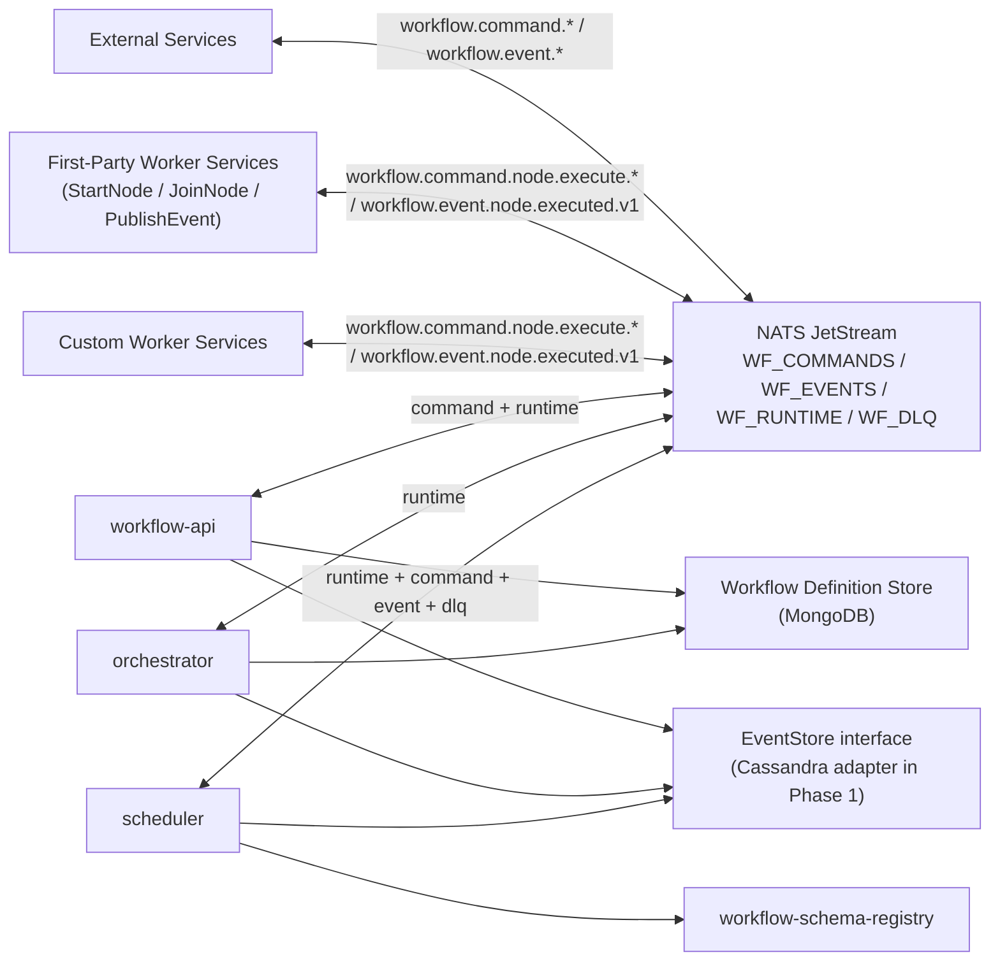
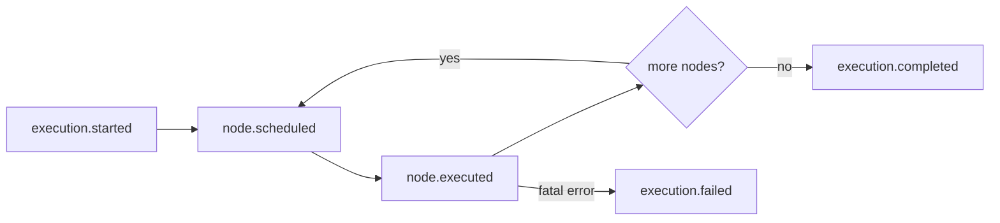
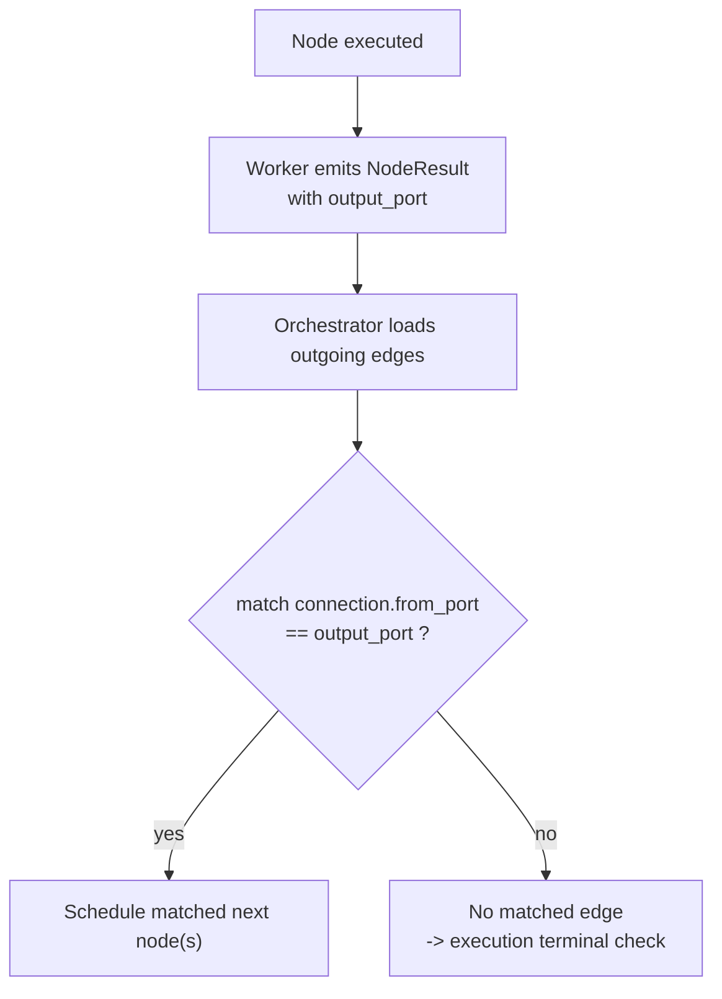
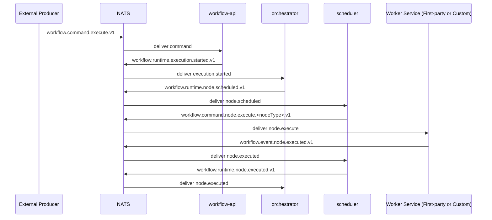
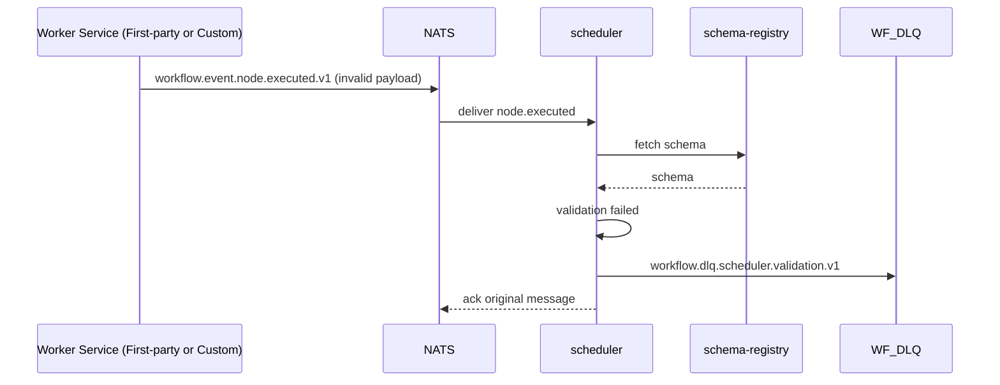

# Workflow Engine Technical Design (Workflow-Centric, Messaging v2)

## 1. Why This System Exists

### 1.1 Core Problem

Modern business workflows need a system that can:

- orchestrate complex DAG logic reliably
- separate orchestration from worker implementation
- integrate with external services through stable event contracts
- provide safety guarantees (schema validation, idempotency, DLQ)

This workflow engine solves those needs with an event-driven orchestration architecture.

### 1.2 Design Focus

This system focuses on **orchestration**.  
It does **not** implement worker business logic in the control plane.

All executable nodes, including built-in node types, run as worker services:

- first-party workers (provided by this repository)
- custom workers (provided by integrators)

Both use the same scheduler dispatch/result contract.

### 1.3 Scope and Non-Goals

In scope:

- workflow definition, validation, and orchestration
- MongoDB-backed workflow definition storage and retrieval
- event contracts and runtime coordination
- reliability primitives (dedup, schema validation, DLQ)
- Cassandra-backed EventStore abstraction

Out of scope:

- visual workflow editor
- in-process privileged node execution paths that bypass worker contracts
- full multi-tenant data isolation design in this phase

## 2. System Mental Model

### 2.1 Conceptual View



### 2.2 Component Responsibilities

| Component | Responsibility |
|---|---|
| `workflow-api` | Workflow CRUD and execution entrypoint. Converts REST or command events into runtime execution-start events. |
| `orchestrator` | DAG traversal and execution state progression. Decides next nodes and emits schedule events. |
| `scheduler` | Converts schedule events into worker dispatch commands. Validates node-result schemas and returns execution results to orchestrator. |
| `first-party worker services` | Worker implementations shipped by this repository for built-in node types. Must be running to execute those node types. |
| `custom worker services` | External worker implementations for custom node types. |
| `workflow-schema-registry` | Versioned schema lookup for event payload validation. |
| `WorkflowDefinitionStore (MongoDB)` | Stores workflow definitions (DSL + normalized structure) for CRUD and orchestration lookup. |
| `EventStore` | Persistent event/audit and dedup record abstraction. |

## 3. Workflow Modeling

### 3.1 Runtime Domain Model

```go
type Workflow struct {
    ID          string
    Nodes       []Node
    Connections []Connection
}

type Node struct {
    ID         string
    Type       NodeType
    Name       string
    Parameters map[string]any
}

type Connection struct {
    FromNode string
    FromPort string // optional, default: "default"
    ToNode   string
    ToPort   string // optional, used by JoinNode
}
```

### 3.2 Node Type Strategy

| Category | Type | Execution Model |
|---|---|---|
| Built-in first-party worker node | `StartNode` | Executed by repo-provided worker service |
| Built-in first-party worker node | `JoinNode` | Executed by repo-provided worker service |
| Built-in first-party worker node | `PublishEvent` | Executed by repo-provided worker service |
| Custom worker node | `<node_type>@<version>` | Executed by custom worker service |

Normalization rule:

- dispatch subjects use normalized lowercase node identifiers (for example `start-node`, `join-node`, `publish-event`)

### 3.3 YAML DSL Shape

```yaml
id: <workflow-id>
name: <display-name>
description: <text>
version: <semver>

nodes:
  - <node-definition>

connections:
  - <connection-definition>

events:
  - <event-definition> # optional
```

### 3.4 DSL Validation Rules

- each node has `id` and `type`
- each connection has `from` and `to`
- exactly one `StartNode`
- no DAG cycles
- `JoinNode.inputs` must match incoming `to_port`
- event trigger criteria must include `event_name` and `domain`

Supported templates:

- `{{.input.<field>}}`
- `{{.event.<field>}}`
- `{{.node.<id>.<field>}}`

### 3.5 Workflow Definition Persistence (MongoDB)

Workflow definitions are persisted in MongoDB as the source of truth for workflow structure.

Collection example: `workflow_definitions`

```json
{
  "_id": "hr-onboarding",
  "name": "HR Onboarding",
  "version": "1.0.0",
  "dsl_source": "id: hr-onboarding\nnodes: ...",
  "nodes": [],
  "connections": [],
  "events": [],
  "created_at": "2026-03-06T00:00:00Z",
  "updated_at": "2026-03-06T00:00:00Z"
}
```

Recommended indexes:

- unique index on `_id`
- index on `updated_at` (list/recent workflows)
- optional index on `events.name` + `events.domain` (event-trigger lookup)

## 4. Event-Driven Runtime Design

### 4.1 Event Planes and Naming

Naming pattern:

```text
workflow.<plane>.<resource>.<action>[.<nodeType>].v<version>
```

Planes:

- `command`
- `event`
- `runtime`
- `dlq`

### 4.2 Stream Layout (Single JetStream Service)

| Stream | Subjects |
|---|---|
| `WF_COMMANDS` | `workflow.command.>` |
| `WF_EVENTS` | `workflow.event.>` |
| `WF_RUNTIME` | `workflow.runtime.>` |
| `WF_DLQ` | `workflow.dlq.>` |

Constraint:

- do not define broad streams like `workflow.>` alongside plane-specific streams

### 4.3 Core Subjects and Ownership

| Subject | Publisher | Subscriber | Purpose |
|---|---|---|---|
| `workflow.command.execute.v1` | external producer / workflow-api bridge | workflow-api | start execution command |
| `workflow.runtime.execution.started.v1` | workflow-api | orchestrator | internal execution initialization |
| `workflow.runtime.node.scheduled.v1` | orchestrator | scheduler | internal node scheduling command |
| `workflow.command.node.execute.<nodeType>.v<version>` | scheduler | first-party/custom worker | node dispatch |
| `workflow.event.node.executed.v1` | first-party/custom worker | scheduler | node execution result |
| `workflow.runtime.node.executed.v1` | scheduler | orchestrator | internal node completion handoff |
| `workflow.dlq.scheduler.validation.v1` | scheduler | ops/compensation consumer | validation dead-letter |

### 4.4 End-to-End Lifecycle



### 4.5 Routing by Output Port



### 4.6 Join Synchronization Semantics

Orchestrator maintains join state per execution:

- expected predecessors
- completed predecessors
- combined input map by `to_port`

Join scheduling happens only when all required predecessors complete.

Join responsibility split:

| Responsibility | Owner |
|---|---|
| Track predecessor completion | `orchestrator` |
| Persist and update join wait state | `orchestrator` + `EventStore` |
| Decide join readiness and schedule | `orchestrator` |
| Execute post-join node behavior | `JoinNode` first-party worker |

Rule:

- join readiness must never depend on worker-local state

### 4.7 Service Boundary

- Orchestrator: "what executes next?"
- Scheduler: "how and where does it execute?"

This boundary enables independent scaling and fault isolation.

## 5. Event Contracts

### 5.1 CloudEvents Envelope

All messages use CloudEvents v1.0.

Required extension fields:

- `workflowid`
- `executionid`
- `idempotencykey`
- `producer`

For node result events, additionally required:

- `nodeid`
- `runindex`
- `attempt`

### 5.2 CloudEvents Examples

Execution command example:

```json
{
  "specversion": "1.0",
  "id": "ce_cmd_01J6ABCDEF",
  "source": "hr-system",
  "type": "workflow.command.execute.v1",
  "subject": "workflow/hr-onboarding",
  "time": "2026-03-05T09:00:00Z",
  "datacontenttype": "application/json",
  "workflowid": "hr-onboarding",
  "executionid": "exec_20260305_0001",
  "idempotencykey": "cmd:hr-system:employee:emp_1001:onboard:v1",
  "producer": "hr-system",
  "data": {
    "workflowId": "hr-onboarding",
    "input": {
      "employeeId": "emp_1001"
    }
  }
}
```

Node result example:

```json
{
  "specversion": "1.0",
  "id": "ce_node_01J6XYZ123",
  "source": "worker/send-email-v1",
  "type": "workflow.event.node.executed.v1",
  "subject": "execution/exec_20260305_0001",
  "time": "2026-03-05T09:00:03Z",
  "datacontenttype": "application/json",
  "workflowid": "hr-onboarding",
  "executionid": "exec_20260305_0001",
  "nodeid": "send-welcome-email",
  "runindex": 0,
  "attempt": 1,
  "idempotencykey": "node:exec_20260305_0001:send-welcome-email:0:1:v1",
  "producer": "worker/send-email-v1",
  "data": {
    "outputPort": "success",
    "outputData": {
      "messageId": "mail_7788"
    }
  }
}
```

Invalid result example (missing `nodeid`) must fail schema validation and be routed to `workflow.dlq.scheduler.validation.v1`.

## 6. Reliability and Safety

### 6.1 Idempotency and Dedup

Dedup keys:

- execute command: `source + idempotencykey`
- node result: `executionid + nodeid + runindex + attempt + idempotencykey`

NATS-level dedup:

- set `Nats-Msg-Id` to CloudEvent `id`
- enable JetStream dedup window

Business-level dedup remains in EventStore.

Example keys:

```text
hr-system|cmd:hr-system:employee:emp_1001:onboard:v1
exec_20260304_0001|send-welcome-email|0|1|node:exec_20260304_0001:send-welcome-email:0:1:v1
```

### 6.2 Schema Validation and DLQ

Scheduler validates `workflow.event.node.executed.v1` against schema registry.

Lookup API:

```text
GET /schemas/events/{eventType}/versions/{version}
```

Cache:

- in-memory LRU with TTL
- refresh on version/ETag changes

On validation failure:

- publish to `workflow.dlq.scheduler.validation.v1`
- ACK original message to avoid infinite redelivery

NATS built-in assistance:

- `MaxDeliver`, `AckWait`, `BackOff`
- advisory monitoring via `$JS.EVENT.ADVISORY.CONSUMER.MAX_DELIVERIES...`

### 6.3 ACL Model

Principle: `default deny`, per-service credentials.

| Principal | Publish Allow | Subscribe Allow |
|---|---|---|
| `workflow-api` | `workflow.runtime.execution.started.v1` | `workflow.command.execute.v1` |
| `orchestrator` | `workflow.runtime.node.scheduled.v1` | `workflow.runtime.execution.started.v1`, `workflow.runtime.node.executed.v1` |
| `scheduler` | `workflow.command.node.execute.>`, `workflow.runtime.node.executed.v1`, `workflow.dlq.scheduler.validation.v1` | `workflow.runtime.node.scheduled.v1`, `workflow.event.node.executed.v1` |
| `external-producer` | `workflow.command.execute.v1` | none |
| `first-party-worker` | `workflow.event.node.executed.v1` | `workflow.command.node.execute.<builtInNodeType>.>` |
| `external-worker` | `workflow.event.node.executed.v1` | `workflow.command.node.execute.<nodeType>.>` |
| `ops-dlq-consumer` | none | `workflow.dlq.>` |

Example permission shape:

```hcl
# scheduler
publish   = ["workflow.command.node.execute.>", "workflow.runtime.node.executed.v1", "workflow.dlq.scheduler.validation.v1"]
subscribe = ["workflow.runtime.node.scheduled.v1", "workflow.event.node.executed.v1"]
```

## 7. Data and State Stores

### 7.1 Workflow Definition Store (MongoDB)

Primary responsibility:

- persist workflow definitions for CRUD
- serve orchestration-time lookup (`workflow_id` -> definition)

Primary query paths:

- `GetByID(workflow_id)`
- `ListWorkflows()`
- `FindByEventTrigger(event_name, domain)` (if event-driven start is enabled)

### 7.2 EventStore Interface

```go
type EventStore interface {
  Append(ctx context.Context, event CloudEvent) error
  ExistsByDedupKey(ctx context.Context, dedupKey string) (bool, error)
  SaveDedupRecord(ctx context.Context, dedupKey string, ttl time.Duration) error
}
```

### 7.3 Cassandra Keyspace and Tables

```sql
CREATE KEYSPACE IF NOT EXISTS workflow_engine
WITH replication = {
  'class': 'NetworkTopologyStrategy',
  'datacenter1': 3
};
```

```sql
CREATE TABLE IF NOT EXISTS workflow_engine.execution_events (
  execution_id text,
  event_day date,
  event_time timestamp,
  event_id text,
  workflow_id text,
  event_type text,
  source text,
  subject text,
  payload text,
  PRIMARY KEY ((execution_id, event_day), event_time, event_id)
) WITH CLUSTERING ORDER BY (event_time ASC, event_id ASC);
```

```sql
CREATE TABLE IF NOT EXISTS workflow_engine.dedup_keys (
  dedup_key text PRIMARY KEY,
  created_at timestamp
);
```

### 7.4 Query Paths and Write Rules

Primary query paths:

- append/replay by `execution_id`
- fetch recent events by `execution_id + event_day`
- idempotency check by `dedup_key`

Dedup write pattern (LWT):

```sql
INSERT INTO workflow_engine.dedup_keys (dedup_key, created_at)
VALUES (?, toTimestamp(now()))
IF NOT EXISTS
USING TTL ?;
```

Interpretation:

- `applied=true`: first seen, continue processing
- `applied=false`: duplicate, skip processing

### 7.5 Operational Defaults

- RF: 3 (production baseline)
- write consistency: `LOCAL_QUORUM`
- read consistency: `LOCAL_QUORUM`
- dedup TTL: 24h to 72h (by message class)

## 8. Runtime Behavior Examples

### 8.1 End-to-End Execution Sequence



### 8.2 Validation Failure Sequence



## 9. Scalability and Operational Notes

- Orchestrator scales with execution concurrency and join-state pressure.
- Scheduler scales with node throughput and dispatch load.
- Workers scale by node-type queue depth.
- Use queue groups for horizontal runtime consumers.
- Use distributed join state backing for multi-orchestrator deployments.

Built-in worker availability rule:

- built-in node types are available only when first-party worker services are deployed and healthy

## 10. Open Questions

- Should `workflow.command.execute.v1` support batch execution semantics?
- Which service should own `attempt` increments: scheduler or orchestrator?
- What should be the default schema-registry outage policy: fail-open or fail-closed?
