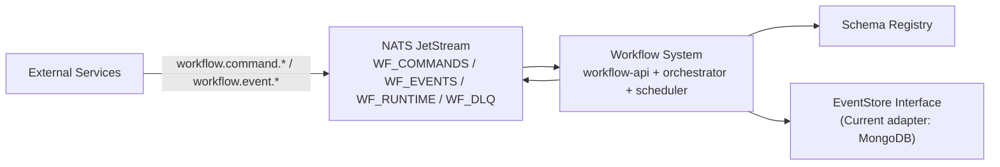
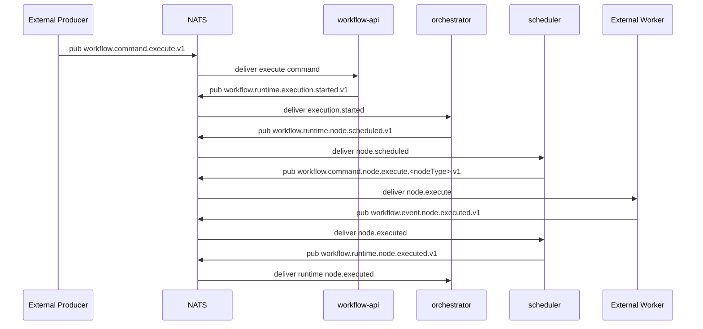
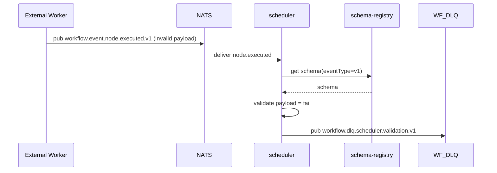

# Workflow Messaging Architecture Design

## 1. Context and Goals

This document defines the messaging architecture for the workflow system on a single NATS JetStream cluster. The focus is:

- A `workflow`-centric external integration experience
- Subject namespace separation by messaging plane
- Separate streams for separate messaging planes
- Actionable ACL and idempotency key specifications
- Storage abstraction via an `EventStore` interface, with MongoDB as the first adapter

This design uses three primary messaging planes:

- `command`: commands sent to the workflow system
- `event`: events published by the workflow system to external systems
- `runtime`: internal workflow engine coordination events

## 2. Non-Goals

- Defining worker internal implementation details
- Defining full OpenTelemetry implementation details (added later)
- Binding the system to one specific event store product (MongoDB is the initial choice)

## 3. High-Level Design



### 3.1 Core Components and Responsibilities

| Component | Responsibility |
|---|---|
| `workflow-api` | Handles REST and `workflow.command.execute.v1`, then emits runtime start events |
| `orchestrator` | Maintains workflow execution state, decides next nodes, publishes `workflow.runtime.node.scheduled.v1` |
| `scheduler` | Consumes scheduling commands, dispatches node commands, validates node result schema, and emits runtime node results |
| `workflow-schema-registry` | Provides versioned event schema lookup for scheduler validation |
| `EventStore` | Stores processing traces and idempotency records to avoid duplicate handling |

### 3.2 EventStore Abstraction (MongoDB First)

Design principle: services depend on the `EventStore` interface, not directly on a Mongo driver.

```go
type EventStore interface {
  Append(ctx context.Context, event CloudEvent) error
  ExistsByDedupKey(ctx context.Context, dedupKey string) (bool, error)
  SaveDedupRecord(ctx context.Context, dedupKey string, ttl time.Duration) error
}
```

Current implementation:

- `MongoEventStore` is the first adapter
- Dedup collection uses a unique index for deduplication
- TTL index controls dedup record retention

Future replacement (for example PostgreSQL or Redis) should not affect core orchestrator/scheduler/workflow-api logic.

## 4. Subject Naming Conventions

### 4.1 Naming Pattern

```text
workflow.<plane>.<resource>.<action>[.<nodeType>].v<version>
```

- `plane`: `command | event | runtime | dlq`
- `resource/action`: lowercase tokens (recommended `noun.verb`)
- `nodeType`: required only for node dispatch subjects
- `version`: version suffix, for example `v1`, `v2`

### 4.2 Reserved Rules and Restrictions

- All lowercase, dot-separated tokens
- Do not use broad wildcard stream subjects like `workflow.>`
- `runtime` is internal-only; external accounts must not publish or subscribe to runtime subjects

### 4.3 Core Subjects

| Type | Subject | Publisher | Subscriber |
|---|---|---|---|
| External workflow trigger | `workflow.command.execute.v1` | External Producer / workflow-api (REST bridge) | workflow-api |
| Internal execution start | `workflow.runtime.execution.started.v1` | workflow-api | orchestrator |
| Internal node scheduling | `workflow.runtime.node.scheduled.v1` | orchestrator | scheduler |
| Node task dispatch | `workflow.command.node.execute.<nodeType>.v<version>` | scheduler | External Worker |
| External node execution result | `workflow.event.node.executed.v1` | External Worker | scheduler |
| Internal node result handoff | `workflow.runtime.node.executed.v1` | scheduler | orchestrator |
| Validation failure dead letter | `workflow.dlq.scheduler.validation.v1` | scheduler | DLQ consumer / ops |

## 5. Stream Design and Non-Overlap Rules

### 5.1 Stream Plan

| Stream | Subjects | Purpose |
|---|---|---|
| `WF_COMMANDS` | `workflow.command.>` | External and system commands |
| `WF_EVENTS` | `workflow.event.>` | Workflow outbound events |
| `WF_RUNTIME` | `workflow.runtime.>` | Internal workflow coordination |
| `WF_DLQ` | `workflow.dlq.>` | Validation and processing dead letters |

### 5.2 Overlap Examples

Correct:

```text
WF_COMMANDS -> workflow.command.>
WF_EVENTS   -> workflow.event.>
WF_RUNTIME  -> workflow.runtime.>
WF_DLQ      -> workflow.dlq.>
```

Incorrect (overlap):

```text
WF_ALL      -> workflow.>
WF_RUNTIME  -> workflow.runtime.>
```

Why this is wrong: `WF_ALL` already matches `workflow.runtime.>`, so one message can be stored in two streams, increasing replay complexity, retention complexity, and storage cost.

### 5.3 Consumer Binding Rules

- Every consumer must set `FilterSubject`; never consume `workflow.>` directly
- Runtime consumers can only bind to `workflow.runtime.*`
- Command and event consumers must not bind across planes
- During migration, any temporary dual-write must include a clear decommission date and rollback/removal plan

## 6. ACL Matrix

Principle: `default deny`; only allow minimum required subjects, and use separate credentials per service when possible.

| Principal | Publish Allow | Subscribe Allow | Notes |
|---|---|---|---|
| `workflow-api` | `workflow.runtime.execution.started.v1` | `workflow.command.execute.v1` | Supports REST execute bridging |
| `orchestrator` | `workflow.runtime.node.scheduled.v1` | `workflow.runtime.execution.started.v1`, `workflow.runtime.node.executed.v1` | Runtime-only access |
| `scheduler` | `workflow.command.node.execute.>`, `workflow.runtime.node.executed.v1`, `workflow.dlq.scheduler.validation.v1` | `workflow.runtime.node.scheduled.v1`, `workflow.event.node.executed.v1` | Entry point for external node results |
| `external-producer` | `workflow.command.execute.v1` | (none) | Execute command only |
| `external-worker` | `workflow.event.node.executed.v1` | `workflow.command.node.execute.<nodeType>.>` | Restrict each worker account to owned node type(s) |
| `ops-dlq-consumer` | (none) | `workflow.dlq.>` | Monitoring and compensation workflows |

## 7. Idempotency Key Specification

### 7.1 Required CloudEvents Extensions

- `executionid`
- `workflowid`
- `idempotencykey`
- `producer` (service name)

Additional required fields for node events:

- `nodeid`
- `runindex`
- `attempt`

### 7.2 Dedup Key Design

#### A. Execute Command (`workflow-api`)

- Dedup key: `source + idempotencykey`
- Recommended unique index TTL: 24h to 72h
- Duplicate behavior: return existing `executionId` instead of creating a new execution

#### B. Node Result (`scheduler`)

- Dedup key: `executionid + nodeid + runindex + attempt + idempotencykey`
- Duplicate behavior: ACK directly and log `duplicate=true`

#### C. NATS Publish Dedup

- All publishers set `Nats-Msg-Id=<CloudEvent id>`
- Enable JetStream dedup window (for example 2 minutes)
- Note: this is short-window protection only; business-level dedup still requires data-layer unique keys

### 7.3 Idempotency Field and Key Examples

#### A. `workflow.command.execute.v1` example

```json
{
  "specversion": "1.0",
  "id": "ce_cmd_01J1P2X7M8N9",
  "source": "hr-system",
  "type": "workflow.command.execute.v1",
  "subject": "workflow/hr-onboarding",
  "time": "2026-03-04T10:00:00Z",
  "datacontenttype": "application/json",
  "workflowid": "hr-onboarding",
  "executionid": "exec_20260304_0001",
  "idempotencykey": "cmd:hr-system:employee:emp_1001:onboard:v1",
  "producer": "hr-system",
  "data": {
    "workflowId": "hr-onboarding",
    "input": {
      "employeeId": "emp_1001"
    }
  }
}
```

NATS header:

```text
Nats-Msg-Id: ce_cmd_01J1P2X7M8N9
```

Dedup key (`workflow-api`):

```text
hr-system|cmd:hr-system:employee:emp_1001:onboard:v1
```

#### B. `workflow.event.node.executed.v1` example

```json
{
  "specversion": "1.0",
  "id": "ce_node_01J1P2Y12345",
  "source": "worker/email-sender",
  "type": "workflow.event.node.executed.v1",
  "subject": "execution/exec_20260304_0001",
  "time": "2026-03-04T10:00:05Z",
  "datacontenttype": "application/json",
  "workflowid": "hr-onboarding",
  "executionid": "exec_20260304_0001",
  "nodeid": "send-welcome-email",
  "runindex": 0,
  "attempt": 1,
  "idempotencykey": "node:exec_20260304_0001:send-welcome-email:0:1:v1",
  "producer": "worker/email-sender",
  "data": {
    "outputPort": "success",
    "outputData": {
      "messageId": "mail_7788"
    }
  }
}
```

Dedup key (`scheduler`):

```text
exec_20260304_0001|send-welcome-email|0|1|node:exec_20260304_0001:send-welcome-email:0:1:v1
```

## 8. Schema Validation and Schema Service

Introduce an abstract service: `workflow-schema-registry` (control plane service).

- Query API: `GET /schemas/events/{eventType}/versions/{version}`
- Supports versioned event schemas referenced by workflows
- Before handling `workflow.event.node.executed.v1`, scheduler fetches (or reuses cached) schema and validates payload
- On validation failure, scheduler publishes to `workflow.dlq.scheduler.validation.v1`

Recommended caching strategy:

- In-memory LRU + TTL (for example 5 minutes)
- Refresh only when schema ETag/version changes
- Behavior when schema service is unavailable must be configurable: fail-closed or fail-open

## 9. DLQ Strategy (Including NATS Built-ins)

### 9.1 Conclusion

NATS JetStream built-ins can help with DLQ behavior, but in most cases a small application-level forwarder is still needed for complete DLQ payload handling.

### 9.2 Recommended Primary Approach (Application-Level DLQ Publish)

- Consumer (for example scheduler) publishes directly to `workflow.dlq.scheduler.validation.v1` when schema validation fails
- DLQ payload includes `reason`, `originalSubject`, `originalEventId`, `payload`, and `failedAt`
- After DLQ publish, ACK the original message to avoid infinite redelivery loops

Benefits: predictable behavior, complete payload retention, and direct compatibility with compensation workflows.

### 9.3 NATS Built-in Assisted Approach (MaxDeliver + Advisory)

- Configure consumer `MaxDeliver`, `AckWait`, and `BackOff`
- When max deliveries are exceeded, JetStream emits advisory events, for example:  
  `$JS.EVENT.ADVISORY.CONSUMER.MAX_DELIVERIES.<stream>.<consumer>`
- A `dlq-forwarder` can subscribe to advisories, retrieve original message context, and publish to `workflow.dlq.*`

Limitations:

- Advisory messages are not full business payloads
- Full DLQ payload still requires additional forwarder logic
- Recommended model: application-level DLQ publish + JetStream advisory for monitoring and alerting

## 10. Runtime Sequence Diagrams

### 10.1 External Workflow Trigger



### 10.2 Scheduler Schema Validation Failure



## 11. Implementation Recommendations (Phase 1)

1. Create subject and stream provisioning scripts with explicit non-overlap checks.
2. Apply ACLs (`default deny`) before enabling consumers.
3. Implement idempotency store in workflow-api and scheduler (Mongo unique indexes).
4. Enable scheduler schema validation and DLQ publishing.
5. Add OTel tracing/span attributes and cross-service correlation after core message safety is in place.

## 12. Open Questions

- Should `workflow.command.execute.v1` support batch execution?
- Which service should own `attempt` incrementing: scheduler or orchestrator?
- What should be the default behavior when schema registry is unavailable: fail-open or fail-closed?
