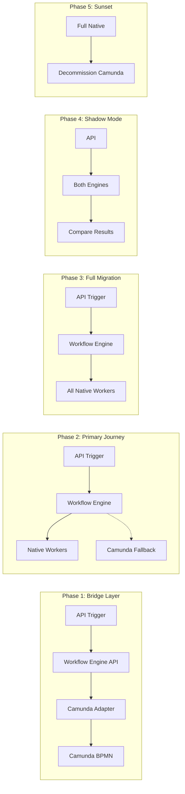
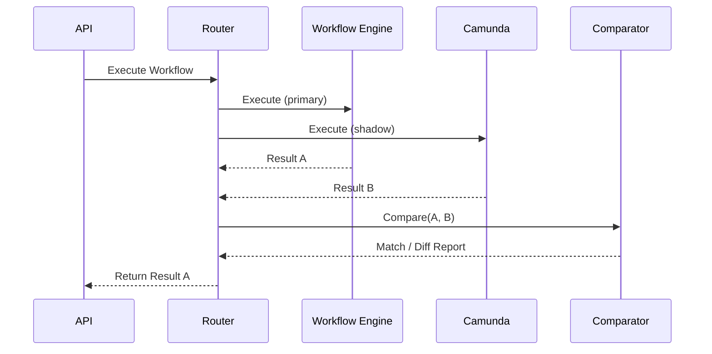

# Camunda to Workflow Engine Migration Plan

## Executive Summary

This document outlines a phased migration strategy to transition workflow logic from a Java-based Camunda application to the Go-based workflow orchestration engine. The approach prioritizes **risk mitigation** through incremental adoption, parallel running, and feature parity validation.

---

## Weekly Demo Schedule (PM Review)

| Week | Topic | Demo Items | Success Criteria | Next Actions | Risks / Blockers |
|------|-------|------------|------------------|--------------|------------------|
| **W1** | API Bridge Foundation | • Workflow API endpoint (`POST /workflows/:id/execute`)<br>• Camunda adapter calling existing BPMN | API triggers Camunda process via workflow engine | Implement workflow mapping registry | Camunda REST API access |
| **W2** | Workflow Mapping & Status | • Workflow-to-Camunda process mapping<br>• Execution status API (`GET /executions/:id`) | Can track execution status from workflow engine | Start CreateTask node implementation | - |
| **W3** | CreateTask Node | • `CreateTask` system node<br>• Task storage in MongoDB<br>• YAML DSL with CreateTask | Create task via YAML workflow | Add AssignTask, UpdateTask nodes | Task schema design |
| **W4** | Task Lifecycle Nodes | • `AssignTask` + `UpdateTask` nodes<br>• Task state transitions | Full task CRUD via workflow nodes | Implement WaitTimeout + signals | - |
| **W5** | WaitTimeout & Signals | • `WaitTimeout` node (durable timer)<br>• Signal-based task completion | Workflow waits for user action or timeout | Migrate first real workflow | Timer service complexity |
| **W6** | Primary Journey Migration | • First Camunda workflow running natively<br>• Side-by-side comparison | Identical output to Camunda execution | Expand to more workflows | Edge cases in BPMN |
| **W7** | Shadow Mode Validation | • Parallel execution (native + Camunda)<br>• Comparison dashboard | 95%+ output match rate | Fix discrepancies | - |
| **W8** | Full Migration Rollout | • All workflows migrated<br>• Production readiness checklist | All tests passing, no regressions | Plan Camunda sunset | - |

### Demo Format

Each weekly demo follows this structure:

1. **Recap** (2 min): What was completed since last demo
2. **Live Demo** (10 min): Show working functionality
3. **Metrics** (3 min): Test coverage, performance benchmarks
4. **Next Week Preview** (3 min): Upcoming deliverables
5. **Q&A / Feedback** (10 min): PM input and prioritization

---

## Current State Analysis

### Workflow Engine Capabilities (Target System)

| Capability | Status | Notes |
|------------|--------|-------|
| **DAG-based workflow execution** | ✅ Implemented | Core engine with Orchestrator + Scheduler |
| **YAML DSL for workflow definition** | ✅ Implemented | Declarative workflow definition |
| **Node types** | ⚠️ Partial | `StartNode`, `JoinNode`, `PublishEvent` built-in; third-party nodes via registry |
| **Conditional branching** | ✅ Implemented | Via output ports (`true`/`false`) |
| **Parallel execution + Join** | ✅ Implemented | `JoinNode` with `all`/`any` operators |
| **Event Marketplace** | ✅ Implemented | Inter-workflow event publishing |
| **API Layer** | ⚠️ Partial | Node Registry API exists; Workflow/Execution APIs marked "Future" |
| **Durable timers** | 📋 Designed | TimerService in technical design |
| **Human-in-the-loop (Signals)** | 📋 Designed | Signal mechanism in technical design |
| **Client-side encryption** | 📋 Designed | Zero-knowledge data converter pattern |

### Migration Challenges

1. **API Gap**: Workflow and Execution APIs are not yet implemented
2. **Node Type Gap**: Need to implement/register custom node types matching Camunda tasks
3. **State Migration**: Need strategy for in-flight workflow executions
4. **Feature Parity**: Must validate all Camunda flow behaviors are replicated

---

## Phased Migration Strategy

### Overview



---

## Phase 1: API Bridge Layer (2-3 weeks)

**Goal**: Establish workflow engine as the single entry point while Camunda handles execution.

### 1.1 Implement Workflow API

Create REST endpoints to trigger workflows:

#### [NEW] [handler.go](file:///Users/cheriehsieh/Program/orchestration/internal/api/workflow/handler.go)

```go
// POST /api/v1/workflows/:id/execute
// Triggers workflow execution with input data
```

#### [NEW] [service.go](file:///Users/cheriehsieh/Program/orchestration/internal/api/workflow/service.go)

```go
// WorkflowService coordinates workflow execution
// Initially delegates to CamundaAdapter
```

### 1.2 Implement Camunda Adapter

Create an adapter that forwards execution requests to Camunda:

#### [NEW] [adapter.go](file:///Users/cheriehsieh/Program/orchestration/internal/camunda/adapter.go)

```go
type CamundaAdapter struct {
    client *CamundaClient
}

// StartProcess starts a Camunda process instance
func (a *CamundaAdapter) StartProcess(ctx context.Context, processKey string, variables map[string]any) (*ProcessInstance, error)

// GetProcessStatus returns the status of a process instance
func (a *CamundaAdapter) GetProcessStatus(ctx context.Context, instanceID string) (*ProcessStatus, error)
```

### 1.3 Workflow Mapping Registry

Map workflow engine IDs to Camunda process keys:

#### [NEW] [mapping.go](file:///Users/cheriehsieh/Program/orchestration/internal/camunda/mapping.go)

```go
type WorkflowMapping struct {
    WorkflowID     string // Workflow engine ID
    CamundaProcess string // Camunda BPMN process key
    MigrationPhase string // "camunda" | "hybrid" | "native"
}
```

### Phase 1 Deliverables

- [ ] Workflow API (trigger, status, list)
- [ ] Camunda REST adapter
- [ ] Workflow-to-process mapping registry
- [ ] Basic health checks and monitoring

---

## Phase 2: Primary User Journey Migration (4-6 weeks)

**Goal**: Migrate the most critical user journey to native workflow engine execution.

### 2.1 Identify Primary Journey

> [!IMPORTANT]
> **User Input Required**: Which workflow is the "primary user journey"?  
> Please provide:
> 1. The Camunda BPMN file or process key
> 2. The node types (service tasks) used in the workflow
> 3. Any external integrations (HTTP calls, databases, message queues)

### 2.2 Node Type Implementation

For each Camunda service task, implement a corresponding worker:

#### Common Node Types to Implement

| Camunda Task | Workflow Engine Node | Worker Required |
|--------------|---------------------|-----------------|
| HTTP Request | `http-request@v1` | Yes |
| Database Query | `db-query@v1` | Yes |
| Send Email | `email-sender@v1` | Yes |
| Condition Check | `condition-check@v1` | Yes (or use IfNode) |
| Wait/Timer | Durable Timer | Platform feature |

#### [NEW] [worker/http_request.go](file:///Users/cheriehsieh/Program/orchestration/cmd/worker/http_request/main.go)

Example worker implementation following the existing worker pattern.

### 2.3 Workflow Definition Translation

Convert BPMN to YAML DSL:

**Camunda BPMN** → **Workflow Engine YAML**

```yaml
# Example: Order Processing Workflow
id: order-processing
name: "Order Processing (Migrated from Camunda)"
version: "1.0.0"

nodes:
  - id: start
    type: StartNode
    name: "Start Order"

  - id: validate
    type: order-validator@v1
    parameters:
      strict_mode: true

  - id: process-payment
    type: payment-processor@v1
    parameters:
      gateway: "stripe"

connections:
  - from: start
    to: validate
  - from: validate
    to: process-payment
```

### 2.4 Feature Gap Implementation

Based on the primary journey, implement missing platform features:

| Feature | Required By | Estimated Effort |
|---------|-------------|------------------|
| Durable Timers | Wait nodes | 1 week |
| Error Handling + Retry | Fault tolerance | 1 week |
| Execution History API | Monitoring | 3 days |
| Input Validation | Data integrity | 2 days |

### Phase 2 Deliverables

- [ ] Primary journey converted to YAML DSL
- [ ] All required node workers implemented and registered
- [ ] Missing platform features added
- [ ] Integration tests passing

---

## Phase 3: Full Workflow Migration (6-8 weeks)

**Goal**: Migrate all remaining workflows from Camunda.

### 3.1 Inventory and Prioritization

Create a migration backlog:

```
| Priority | Workflow | Complexity | Dependencies | Status |
|----------|----------|------------|--------------|--------|
| High     | order-processing | Medium | payment-gw | ✅ Done |
| High     | user-signup | Low | email-svc | 🔄 In Progress |
| Medium   | inventory-sync | High | ext-api | ⏳ Pending |
| Low      | report-gen | Low | - | ⏳ Pending |
```

### 3.2 Batch Migration Process

For each workflow:

1. **Analyze**: Document BPMN structure, tasks, and edge cases
2. **Translate**: Convert to YAML DSL
3. **Implement**: Create missing workers
4. **Test**: Validate with production-like data
5. **Deploy**: Enable in workflow mapping registry
6. **Monitor**: Watch for errors and performance issues

### 3.3 Routing Strategy

Update the mapping registry to support gradual rollout:

```go
type WorkflowMapping struct {
    WorkflowID       string
    CamundaProcess   string
    MigrationPhase   string
    NativeEnabled    bool    // Execute via workflow engine
    RolloutPercent   int     // 0-100% traffic to native
}
```

### Phase 3 Deliverables

- [ ] All workflows converted to YAML DSL
- [ ] All workers implemented and tested
- [ ] Migration tracking dashboard

---

## Phase 4: Shadow Mode Validation (2-3 weeks)

**Goal**: Run both engines in parallel to validate correctness.

### 4.1 Shadow Execution



#### [NEW] [shadow.go](file:///Users/cheriehsieh/Program/orchestration/internal/migration/shadow.go)

```go
type ShadowExecutor struct {
    native  Executor
    camunda Executor
}

func (s *ShadowExecutor) Execute(ctx context.Context, workflowID string, input map[string]any) (*Result, error) {
    // Execute both
    nativeResult := s.native.Execute(ctx, workflowID, input)
    camundaResult := s.camunda.Execute(ctx, workflowID, input)
    
    // Compare and log differences
    s.compare(nativeResult, camundaResult)
    
    // Return native result
    return nativeResult, nil
}
```

### 4.2 Comparison Metrics

- **Output Match Rate**: % of executions with identical outputs
- **Timing Comparison**: Execution time differences
- **Error Rate**: Error frequency comparison
- **State Transitions**: DAG traversal path validation

### Phase 4 Deliverables

- [ ] Shadow executor implementation
- [ ] Comparison dashboard
- [ ] 99%+ output match rate achieved

---

## Phase 5: Sunset Camunda (2-4 weeks)

**Goal**: Safely decommission Camunda after validation.

### 5.1 Pre-Sunset Checklist

- [ ] All workflows migrated (Phase 3)
- [ ] Shadow validation passed (Phase 4)
- [ ] No in-flight Camunda executions
- [ ] Rollback plan documented
- [ ] Stakeholder sign-off

### 5.2 Sunset Steps

1. **Disable new Camunda starts**: Route 100% traffic to workflow engine
2. **Drain in-flight**: Wait for all Camunda processes to complete
3. **Archive**: Backup Camunda database and BPMN files
4. **Decommission**: Stop Camunda services
5. **Cleanup**: Remove Camunda adapter code (optional)

### 5.3 Rollback Plan

If issues arise post-sunset:

1. Re-enable Camunda services
2. Update routing to fallback
3. Investigate and fix
4. Re-attempt migration

### Phase 5 Deliverables

- [ ] Camunda services stopped
- [ ] Infrastructure decommissioned
- [ ] Documentation updated
- [ ] Migration retrospective completed

---

## Verification Plan

### Automated Testing

#### Unit Tests (Existing)

```bash
# Run all existing tests
make test

# Or directly:
go test ./internal/... -v
```

#### Integration Tests (New)

> [!IMPORTANT]
> Integration tests will be added during Phase 1-2 implementation.

```bash
# Future command
go test ./tests/integration/... -v
```

### Manual Verification

#### Phase 1: API Bridge

1. Start workflow engine: `make run` or `go run ./cmd/workflow-api`
2. Trigger a workflow via API:
   ```bash
   curl -X POST http://localhost:8081/api/v1/workflows/order-processing/execute \
     -H "Content-Type: application/json" \
     -d '{"order_id": "123", "amount": 99.99}'
   ```
3. Verify Camunda received the request (check Camunda Cockpit or logs)
4. Check execution status via API:
   ```bash
   curl http://localhost:8081/api/v1/executions/{execution-id}
   ```

#### Phase 2: Primary Journey

1. Execute primary journey workflow via workflow engine
2. Verify all nodes complete successfully
3. Compare output with equivalent Camunda execution

#### Phase 4: Shadow Mode

1. Enable shadow mode in configuration
2. Execute 100+ workflow instances
3. Review comparison dashboard for discrepancies
4. Investigate and resolve any mismatches

---

## User Review Required

> [!IMPORTANT]
> Please provide feedback on the following before proceeding:

1. **Primary User Journey**: Which workflow should be migrated first?
2. **Camunda Access**: Is there a Camunda REST API available, or do we need a different integration method?
3. **Timeline**: Are the estimated timelines (2-3 weeks per phase) realistic for your team?
4. **Node Types**: What are the most common Camunda service tasks used in your workflows?
5. **In-Flight Handling**: How should we handle in-flight Camunda executions during migration?

---

## Risk Mitigation

| Risk | Mitigation |
|------|------------|
| Feature gap discovered late | Phase 2 identifies all requirements upfront |
| Data loss during migration | No data migration needed; event sourcing starts fresh |
| Performance regression | Shadow mode (Phase 4) catches issues before sunset |
| Rollback needed | Camunda remains available until Phase 5 completion |

---

## Appendix A: Platform-Provided Node Types

These are **built-in system nodes** provided by the workflow engine (not Event Marketplace events):

### Current System Nodes

| Node Type | Status | Description |
|-----------|--------|-------------|
| `StartNode` | ✅ Implemented | Entry point of workflow |
| `JoinNode` | ✅ Implemented | Waits for multiple predecessors |
| `PublishEvent` | ✅ Implemented | Publishes to Event Marketplace (for business events) |

### New Task Lifecycle Nodes (To Implement)

| Node Type | Description | Key Parameters |
|-----------|-------------|----------------|
| `CreateTask` | Creates a task with data properties | `data`, `assignee`, `due_date` |
| `AssignTask` | Assigns task to specific user(s) | `task_id`, `assignees` |
| `UpdateTask` | Updates task data properties | `task_id`, `updates` |
| `CompleteTask` | Marks task as completed | `task_id`, `result` |
| `DeleteTask` | Deletes/cancels a task | `task_id`, `reason` |
| `WaitTimeout` | Waits until timeout or signal | `duration`, `timeout_port` |

### Example: Task Workflow in YAML DSL

```yaml
id: approval-workflow
name: "Document Approval"
version: "1.0.0"

nodes:
  - id: start
    type: StartNode

  - id: create-review-task
    type: CreateTask
    parameters:
      data:
        title: "Review document: {{.input.doc_id}}"
        type: "review"
      due_date: "{{.input.deadline}}"

  - id: wait-for-completion
    type: WaitTimeout
    parameters:
      duration: "48h"
      signal: "task_completed"

  - id: handle-timeout
    type: UpdateTask
    parameters:
      task_id: "{{.node.create-review-task.task_id}}"
      updates:
        status: "escalated"

connections:
  - from: start
    to: create-review-task
  - from: create-review-task
    to: wait-for-completion
  - from: wait-for-completion
    from_port: timeout
    to: handle-timeout
```

> [!NOTE]
> **Event Marketplace** is reserved for **business events** (e.g., `order.created`, `payment.completed`) that third-party workflows subscribe to. Task lifecycle nodes are internal platform primitives.

---

## Appendix B: Node Type Mapping Reference

| Camunda Element | Workflow Engine Equivalent |
|-----------------|---------------------------|
| Start Event | `StartNode` |
| End Event | Implicit (no successors) |
| Service Task | Registered worker node (e.g., `http-request@v1`) |
| User Task | `CreateTask` + `WaitTimeout` (with signal) |
| Exclusive Gateway | Conditional output ports |
| Parallel Gateway | Multiple connections + `JoinNode` |
| Timer Boundary Event | `WaitTimeout` node |
| Message Event | `PublishEvent` + Event Trigger |

---

## Appendix C: Implementation Priority

| Node Type | Priority | Estimated Effort | Dependency |
|-----------|----------|------------------|------------|
| `CreateTask` | **P0** | 3 days | Task storage layer |
| `WaitTimeout` | **P0** | 1 week | Durable Timer service |
| `AssignTask` | **P1** | 2 days | CreateTask |
| `UpdateTask` | **P1** | 2 days | CreateTask |
| `CompleteTask` | **P1** | 1 day | CreateTask |
| `DeleteTask` | **P2** | 1 day | CreateTask |
