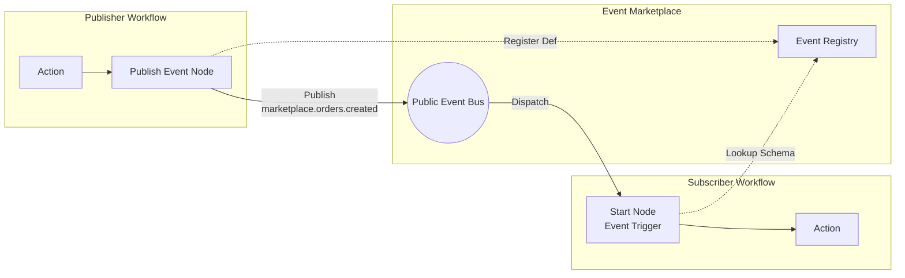

# Workflow Orchestration Engine - Technical Design Document

## 1. Overview

A distributed workflow orchestration engine inspired by n8n, built with event sourcing and NATS JetStream for reliable, scalable workflow execution.

### 1.1 Goals
- Execute complex DAG-based workflows
- Support conditional branching via output ports
- Enable third-party node development
- Provide horizontal scalability
- Maintain complete execution audit trail

### 1.2 Non-Goals
- Visual workflow editor (UI)
- Built-in node library
- Multi-tenancy at the data layer

---

## 2. Architecture

### 2.1 High-Level Architecture

```
┌─────────────────────────────────────────────────────────────────────┐
│                           API Layer                                  │
│  ┌─────────────────┐    ┌─────────────────┐    ┌────────────────┐  │
│  │  Node Registry  │    │  Workflow API   │    │  Execution API │  │
│  │  (Echo REST)    │    │  (Future)       │    │  (Future)      │  │
│  └────────┬────────┘    └─────────────────┘    └────────────────┘  │
└───────────┼─────────────────────────────────────────────────────────┘
            │ JWT Token
┌───────────┼─────────────────────────────────────────────────────────┐
│           ▼           Core Engine Layer                              │
│  ┌─────────────────┐    ┌─────────────────┐    ┌────────────────┐  │
│  │   Orchestrator  │◄──►│    Scheduler    │◄──►│    Workers     │  │
│  │  (DAG Traversal)│    │  (Dispatch)     │    │  (Execution)   │  │
│  └────────┬────────┘    └────────┬────────┘    └────────┬───────┘  │
└───────────┼──────────────────────┼──────────────────────┼───────────┘
            │                      │                      │
┌───────────┼──────────────────────┼──────────────────────┼───────────┐
│           ▼                      ▼                      ▼           │
│  ┌─────────────────────────────────────────────────────────────┐   │
│  │                    NATS JetStream                            │   │
│  │  workflow.events.execution | workflow.events.scheduler       │   │
│  │  workflow.nodes.* | workflow.events.results                  │   │
│  └─────────────────────────────────────────────────────────────┘   │
│                              │                                      │
│  ┌─────────────────────────────────────────────────────────────┐   │
│  │                       MongoDB                                │   │
│  │        events | node_registrations | workflows               │   │
│  └─────────────────────────────────────────────────────────────┘   │
│                        Infrastructure Layer                         │
└─────────────────────────────────────────────────────────────────────┘
```

### 2.2 Component Responsibilities

| Component | Responsibility |
|-----------|----------------|
| **Orchestrator** | DAG traversal, node scheduling, execution lifecycle |
| **Scheduler** | Dispatch to workers, status updates, node validation |
| **Worker** | Node execution, result reporting |
| **Node Registry** | Dynamic node registration, JWT auth, health checks |
| **Event Store** | CloudEvents persistence (MongoDB) |
| **Event Bus** | Event distribution (NATS JetStream) |

---

## 3. Data Models

### 3.1 Workflow Definition

```go
type Workflow struct {
    ID          string       `json:"id"`
    Nodes       []Node       `json:"nodes"`
    Connections []Connection `json:"connections"`
}

type Node struct {
    ID         string         `json:"id"`
    Type       NodeType       `json:"type"`
    Name       string         `json:"name"`
    Parameters map[string]any `json:"parameters"`
}

type Connection struct {
    FromNode string `json:"from_node"`
    FromPort string `json:"from_port,omitempty"` // Output port
    ToNode   string `json:"to_node"`
    ToPort   string `json:"to_port,omitempty"`   // Input port (for join nodes)
}
```

### 3.2 Node Registration

```go
type NodeRegistration struct {
    ID          string         `json:"id"`
    NodeType    string         `json:"node_type"`
    Version     string         `json:"version"`
    FullType    string         `json:"full_type"` // e.g., "http-request@v1"
    DisplayName string         `json:"display_name"`
    InputSchema map[string]any `json:"input_schema"`
    OutputPorts []string       `json:"output_ports"`
    Owner       string         `json:"owner"`
    Enabled     bool           `json:"enabled"`
}
```

### 3.3 CloudEvents Format

All events follow the [CloudEvents v1.0](https://cloudevents.io/) specification:

```json
{
    "specversion": "1.0",
    "id": "uuid",
    "source": "orchestration/engine",
    "type": "orchestration.node.completed",
    "subject": "exec-123",
    "data": {
        "node_id": "step-1",
        "output_port": "success",
        "output_data": {...}
    },
    "workflowid": "workflow-abc"
}
```

---

## 4. Event Flow

### 4.1 Execution Lifecycle

```
┌──────────────┐     ┌──────────────┐     ┌──────────────┐     ┌──────────────┐
│  execution   │ ──▶ │    node      │ ──▶ │    node      │ ──▶ │  execution   │
│   started    │     │   scheduled  │     │  completed   │     │  completed   │
└──────────────┘     └──────────────┘     └──────────────┘     └──────────────┘
```

### 4.2 NATS Subject Conventions

| Subject | Publisher | Subscriber | Purpose |
|---------|-----------|------------|---------|
| `workflow.events.execution` | Scheduler | Orchestrator | Execution status |
| `workflow.events.scheduler` | Orchestrator | Scheduler | Node scheduling |
| `workflow.nodes.<type>.<version>` | Scheduler | Workers | Node dispatch |
| `workflow.events.results` | Workers | Scheduler | Execution results |

### 4.3 Conditional Routing (Output Ports)

```
[Check Condition] ──true──▶ [Handle True]
                  ──false─▶ [Handle False]
```

Nodes return an `output_port` field to determine routing:
```go
type NodeResult struct {
    Output map[string]any
    Port   string // "true", "false", "success", "failure", "default"
}
```

### 4.4 Join Nodes (Synchronization)

Join nodes wait for **all predecessors** to complete before executing, combining their outputs.

```
[Fetch User] ──(to_port: user)────┐
                                   ├──▶ [Join Node] ──▶ [Send Email]
[Fetch Orders] ─(to_port: orders)─┘
```

#### Connection with ToPort
```json
{
    "connections": [
        {"from_node": "fetch-user", "to_node": "join", "to_port": "user"},
        {"from_node": "fetch-orders", "to_node": "join", "to_port": "orders"}
    ]
}
```

#### Combined Input to Join Node
```json
{
    "user": { "name": "Alice", "email": "alice@example.com" },
    "orders": [{ "id": 123, "total": 99.99 }]
}
```

#### State Tracking
The Orchestrator maintains a `JoinState` map to track:
- Which predecessors have completed
- Their output data keyed by `ToPort`

When all predecessors complete, the join node is scheduled with combined inputs.

---

## 5. Security

### 5.1 Authentication Flow (JWT + Proxy)

```
1. Developer registers node → Receives JWT token
2. Worker requests connection → Validates JWT
3. Worker connects to NATS → Scoped to registered subject
```

### 5.2 JWT Claims

```json
{
    "sub": "node-registration-id",
    "node_type": "http-request",
    "full_type": "http-request@v1",
    "subject": "workflow.nodes.http-request.v1",
    "consumer_name": "worker-http-request-v1",
    "exp": 1734786400
}
```

---

## 6. API Reference

### 6.1 Node Registry API

| Endpoint | Method | Description |
|----------|--------|-------------|
| `POST /nodes` | Register new node type |
| `GET /nodes` | List all registered nodes |
| `GET /nodes/:fullType` | Get node details |
| `POST /nodes/:fullType/connect` | Get NATS credentials (JWT required) |
| `POST /nodes/:fullType/health` | Worker heartbeat |

---

## 7. Deployment

### 7.1 Services

| Service | Port | Command |
|---------|------|---------|
| Engine | - | `go run ./cmd/engine` |
| Registry | 8082 | `go run ./cmd/registry` |

### 7.2 Dependencies

| Service | Port | Docker Image |
|---------|------|--------------|
| MongoDB | 27017 | `mongo:7.0` |
| NATS JetStream | 4222 | `nats:2.10-alpine` |

### 7.3 Environment Variables

| Variable | Default | Description |
|----------|---------|-------------|
| `APP_ENV` | `development` | Environment (development/production) |
| `PORT` | `8081` | HTTP server port |
| `MONGO_URI` | `mongodb://localhost:27017` | MongoDB connection string |
| `NATS_URL` | `nats://localhost:4222` | NATS server URL |
| `JWT_SECRET` | - | JWT signing secret |

---

## 8. Project Structure

```
orchestration/
├── cmd/
│   ├── engine/          # Workflow engine entry point
│   └── registry/        # Node registry service
├── internal/
│   ├── config/          # Configuration
│   ├── engine/          # Orchestrator, workflow models
│   ├── eventbus/        # NATS JetStream implementation
│   ├── eventstore/      # MongoDB event store
│   ├── registry/        # Node registration service
│   ├── scheduler/       # Dispatch coordination
│   └── worker/          # Worker template
├── docker-compose.yaml
├── Dockerfile
└── Makefile
```

---

## 9. Event Marketplace (Choreography)

The Event Marketplace allows workflows to interact via public, discoverable events. This creates a loosely coupled "Event Mesh" where workflows can publish state and others can be triggered by it.

### 9.1 Core Concepts

1.  **Public Event Bus**: A dedicated NATS subject space (`marketplace.>`) for inter-workflow communication.
2.  **Event Registry**: A catalog of defined events (Topic, Schema, Description) so users can browse what triggers are available.
3.  **Event Triggers**: Workflows can configure their `StartNode` to subscribe to specific marketplace events.

### 9.2 Architecture



### 9.3 Data Models

#### Public Event Definition
```go
type EventDefinition struct {
    Name        string `json:"name"`        // e.g., "orders.created"
    Domain      string `json:"domain"`      // e.g., "ecommerce"
    Description string `json:"description"`
    Schema      any    `json:"schema"`      // JSON Schema for payload
}
```

#### Publish Node Configuration
```json
{
    "type": "PublishEvent",
    "parameters": {
        "event_name": "orders.created",
        "domain": "ecommerce",
        "payload": { "order_id": "{{.input.id}}", "total": "{{.input.total}}" }
    }
}
```

#### Event Trigger (Start Node)
```json
{
    "id": "start",
    "type": "StartNode",
    "trigger": {
        "type": "event",
        "criteria": {
            "event_name": "orders.created",
            "domain": "ecommerce"
        }
    }
}
```

### 9.4 Event Router
The **Scheduler** (or a dedicated component) subscribes to `marketplace.>` and:
1.  Receives a public event.
2.  Queries the **Workflow Repository** for workflows with matching Event Triggers.
3.  Spawns a new execution for each matching workflow, injecting the event payload as input.

---

## 10. WebSocket Proxy

Third-party workers connect via WebSocket since they cannot access the managed NATS directly.

### 9.1 Proxy Flow

```
┌──────────────┐     ┌─────────────────────────────┐     ┌──────────────────┐
│  Third-Party │     │     Node Registry           │     │  Managed NATS    │
│  Worker      │     │     (WebSocket Proxy)       │     │  (Your API Key)  │
└──────┬───────┘     └─────────────┬───────────────┘     └────────┬─────────┘
       │                           │                              │
       │ 1. WS Connect             │                              │
       │    /ws/connect?token=JWT  │                              │
       │══════════════════════════>│                              │
       │                           │                              │
       │                           │ 2. Subscribe to NATS         │
       │                           │    (Platform API Key)        │
       │                           │─────────────────────────────>│
       │                           │                              │
       │ 3. Receive dispatch       │                              │
       │    events                 │<─────────────────────────────│
       │<══════════════════════════│                              │
       │                           │                              │
       │ 4. Send result via WS     │                              │
       │══════════════════════════>│                              │
       │                           │ 5. Publish to results        │
       │                           │─────────────────────────────>│
```

### 9.2 Message Format

```json
// Event from Proxy to Worker
{
    "type": "event",
    "data": { /* CloudEvent JSON */ }
}

// Result from Worker to Proxy
{
    "type": "result",
    "data": { /* CloudEvent JSON */ }
}
```

### 9.3 Security
- Workers authenticate via JWT token (query param or header)
- Proxy subscribes only to the worker's registered subject
- Results are forwarded to `workflow.events.results`

---

## 11. Future Considerations

1.  **NATS Auth Callout** - Tighter integration for worker authentication
2.  **Workflow Versioning** - Immutable workflow definitions
3.  **Retry Policies** - Configurable retry with backoff
4.  **Workflow UI** - Visual editor and monitoring dashboard
5.  **Join Operators** - Support for `any` (OR) in addition to current `all` (AND)
