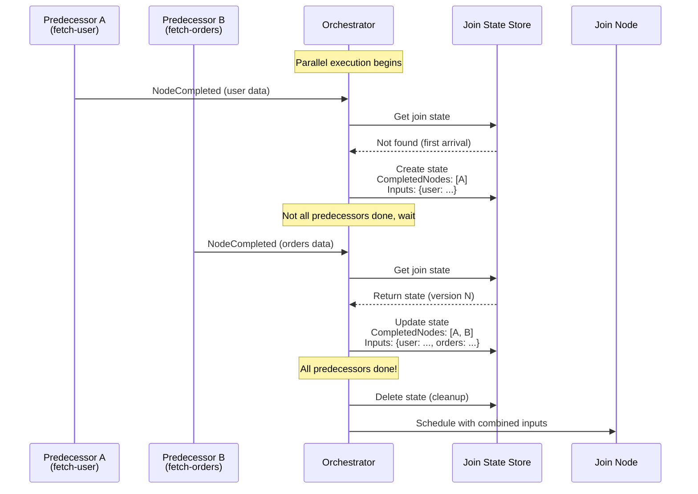
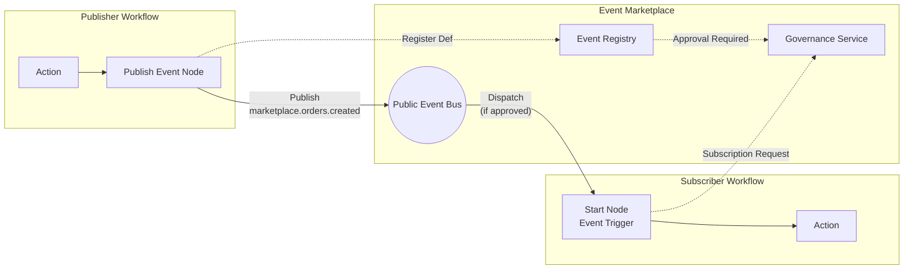
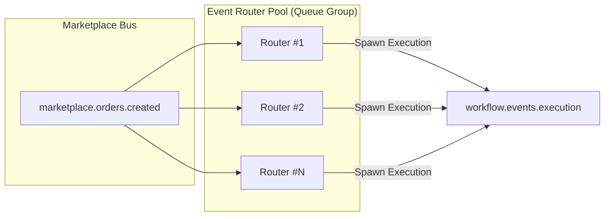

# Workflow Orchestration Engine - Technical Design Document

## 1. Overview

A distributed workflow orchestration engine inspired by n8n, built with event sourcing and NATS JetStream for reliable, scalable workflow execution.

### 1.1 Goals
- Execute complex DAG-based workflows
- Support conditional branching via output ports
- Enable third-party node development
- Provide horizontal scalability
- Maintain complete execution audit trail

### 1.2 Non-Goals
- Visual workflow editor (UI)
- Built-in node library
- Multi-tenancy at the data layer

---

## 2. Architecture

### 2.1 High-Level Architecture

```
┌─────────────────────────────────────────────────────────────────────────┐
│                              API Layer                                   │
│  ┌─────────────────┐    ┌─────────────────┐    ┌─────────────────────┐  │
│  │  Node Registry  │    │  Workflow API   │    │  Execution API      │  │
│  │  (Echo REST)    │    │  (Future)       │    │  (Future)           │  │
│  └─────────────────┘    └─────────────────┘    └─────────────────────┘  │
└─────────────────────────────────────────────────────────────────────────┘

┌─────────────────────────────────────────────────────────────────────────┐
│                         Core Engine Layer                                │
│  ┌─────────────────┐              ┌─────────────────┐                   │
│  │   Orchestrator  │◄────────────►│    Scheduler    │                   │
│  │  (DAG Traversal)│  NATS Events │  (Dispatch)     │                   │
│  └────────┬────────┘              └────────┬────────┘                   │
└───────────┼────────────────────────────────┼────────────────────────────┘
            │                                │
            │         NATS JetStream         │
            ▼                                ▼
┌─────────────────────────────────────────────────────────────────────────┐
│                         Infrastructure Layer                             │
│  ┌─────────────────────────────────────────────────────────────────┐   │
│  │                  NATS JetStream (Hub Cluster)                    │   │
│  │  workflow.events.execution | workflow.events.scheduler           │   │
│  │  workflow.nodes.<type> | workflow.events.results                 │   │
│  └───────────────────────────────┬─────────────────────────────────┘   │
│                                  │ Leaf Node Connection                 │
│  ┌─────────────────────────────────────────────────────────────────┐   │
│  │                        MongoDB                                   │   │
│  │         events | node_registrations | workflows                  │   │
│  │  *Event Sourcing Store (Immutable Ledger)*                       │   │
│  └─────────────────────────────────────────────────────────────────┘   │
│                                  │                                      │
                      ┌────────────┴────────────┐
                      │  NATS Leaf Node Config  │
                      │  • TLS + Credentials    │
                      │  • Scoped subjects      │
                      └────────────┬────────────┘
                                   │
┌──────────────────────────────────┼──────────────────────────────────────┐
│                    Third-Party Workers (External Environments)          │
│                                  │                                      │
│  ┌───────────────────────────────┴───────────────────────────────────┐ │
│  │              Worker-Side NATS (Leaf Node)                         │ │
│  │  • Runs in third-party environment                                │ │
│  │  • Connects to Hub as Leaf Node                                   │ │
│  │  • Subjects: workflow.nodes.<type>, workflow.events.results       │ │
│  └───────────────────────────────┬───────────────────────────────────┘ │
│                                  │                                      │
│  ┌─────────────────┐  ┌─────────────────┐  ┌─────────────────┐         │
│  │  http-request   │  │   send-email    │  │  custom-node    │         │
│  │  Worker @v1     │  │   Worker @v1    │  │  Worker @v1     │         │
│  └─────────────────┘  └─────────────────┘  └─────────────────┘         │
│                                                                          │
│  • Workers connect to their local Leaf Node NATS                        │
│  • Messages routed transparently to/from Hub cluster                    │
│  • Subject access controlled by Leaf Node credentials                   │
└─────────────────────────────────────────────────────────────────────────┘
```

**Communication Paths:**
- **Core Engine ↔ Hub NATS**: Direct connection (Orchestrator, Scheduler)
- **Hub NATS ↔ Leaf Node NATS**: Leaf Node connection (TLS + scoped credentials)
- **External Workers ↔ Leaf Node NATS**: Standard NATS client connection (local)

### 2.2 Component Responsibilities

| Component | Responsibility |
|-----------|----------------|
| **Orchestrator** | DAG traversal, join state management, execution lifecycle, **Replay/Interpreter** |
| **Scheduler** | Dispatch to workers, worker routing, node validation |
| **Worker** | Node execution, result reporting, **Client-Side Encryption** |
| **Node Registry** | Dynamic node registration, JWT auth, health checks |
| **Event Store** | CloudEvents persistence (MongoDB) |
| **Event Bus** | Event distribution (NATS JetStream) |

### 2.3 Orchestrator vs Scheduler Separation

The Orchestrator and Scheduler are designed as **separate services** communicating via NATS JetStream. This separation provides key architectural benefits.

#### Responsibility Boundary

```
┌─────────────────────────────────────────────────────────────────────┐
│                         ORCHESTRATOR                                 │
│  "What to execute next"                                              │
├─────────────────────────────────────────────────────────────────────┤
│  • DAG traversal logic                                               │
│  • Join node state tracking (PendingJoin)                           │
│  • Conditional routing (output ports)                                │
│  • Execution lifecycle (started → completed)                         │
│  • Workflow definition lookup                                        │
└──────────────────────────────┬──────────────────────────────────────┘
                               │
                    NATS JetStream
               (NodeExecutionScheduled)
                               │
                               ▼
┌─────────────────────────────────────────────────────────────────────┐
│                          SCHEDULER                                   │
│  "How to execute it"                                                 │
├─────────────────────────────────────────────────────────────────────┤
│  • Route to correct worker by node type                              │
│  • Validate node parameters against schema                           │
│  • Handle worker timeouts and retries                                │
│  • Load balance across worker instances                              │
│  • Report results back to Orchestrator                               │
└─────────────────────────────────────────────────────────────────────┘
```

#### Benefits of Separation

| Benefit | Description |
|---------|-------------|
| **Independent Scaling** | Scale Orchestrator for more concurrent executions; scale Scheduler for more node throughput |
| **Fault Isolation** | Scheduler overload doesn't corrupt Orchestrator's join states |
| **Deployment Flexibility** | Deploy with different resource profiles (Orchestrator: memory-heavy, Scheduler: CPU-heavy) |
| **Event Replay** | NATS JetStream enables debugging via event replay |
| **Loose Coupling** | Services share no memory; communicate only via events |

### 2.4 Scaling Guidelines

#### Orchestrator Scaling

| Factor | Scaling Trigger | Action |
|--------|-----------------|--------|
| Concurrent executions | High memory usage from PendingJoin states | Add instances, use distributed JoinStateStore |
| Event processing lag | Backlog on `workflow.events.execution` | Add consumer instances |
| Workflow complexity | Many join nodes per workflow | Increase memory per instance |

**State Considerations:** When scaling Orchestrator horizontally, the JoinStateStore must be distributed (e.g., MongoDB or Redis) to ensure all instances see consistent join states.

#### Scheduler Scaling

| Factor | Scaling Trigger | Action |
|--------|-----------------|--------|
| Node throughput | High latency on `workflow.events.scheduler` | Add instances |
| Worker pool size | Many registered node types | Add instances per node type |
| Dispatch latency | Slow worker routing | Optimize node registry lookups |

**Stateless Design:** Scheduler instances are stateless—scale freely without coordination.

#### Worker Scaling

| Factor | Scaling Trigger | Action |
|--------|-----------------|--------|
| Queue depth | Messages backing up on `workflow.nodes.<type>` | Add workers for that node type |
| Execution time | Long-running nodes | Scale workers independently |

```yaml
# Example Kubernetes scaling configuration
orchestrator:
  replicas: 2
  resources:
    memory: 1Gi      # State-heavy (join tracking)
    cpu: 500m

scheduler:
  replicas: 5
  resources:
    memory: 256Mi
    cpu: 1000m       # Dispatch-heavy

workers:
  http-request:
    replicas: 10     # High-volume node type
  send-email:
    replicas: 2      # Low-volume node type
```

---

## 3. Data Models

### 3.1 Workflow Definition

```go
type Workflow struct {
    ID          string       `json:"id"`
    Nodes       []Node       `json:"nodes"`
    Connections []Connection `json:"connections"`
}

type Node struct {
    ID         string         `json:"id"`
    Type       NodeType       `json:"type"`
    Name       string         `json:"name"`
    Parameters map[string]any `json:"parameters"`
}

type Connection struct {
    FromNode string `json:"from_node"`
    FromPort string `json:"from_port,omitempty"` // Output port
    ToNode   string `json:"to_node"`
    ToPort   string `json:"to_port,omitempty"`   // Input port (for join nodes)
}
```

### 3.2 Node Registration

```go
type NodeRegistration struct {
    ID          string         `json:"id"`
    NodeType    string         `json:"node_type"`
    Version     string         `json:"version"`
    FullType    string         `json:"full_type"` // e.g., "http-request@v1"
    DisplayName string         `json:"display_name"`
    InputSchema map[string]any `json:"input_schema"`
    OutputPorts []string       `json:"output_ports"`
    Owner       string         `json:"owner"`
    Enabled     bool           `json:"enabled"`
}
```

### 3.3 CloudEvents Format

All events follow the [CloudEvents v1.0](https://cloudevents.io/) specification:

```json
{
    "specversion": "1.0",
    "id": "uuid",
    "source": "orchestration/engine",
    "type": "orchestration.node.completed",
    "subject": "exec-123",
    "data": {
        "node_id": "step-1",
        "output_port": "success",
        "output_data": {...}
    },
    "workflowid": "workflow-abc"
}
```

### 3.4 Event Sourcing & Persistence (Hybrid-Flow)

The system uses **Event Sourcing** with MongoDB as the source of truth. State is derived by replaying events.

#### History Event Schema
Stored in the `history_events` collection.

```go
type HistoryEvent struct {
    WorkflowID string          `bson:"workflow_id"`
    RunID      string          `bson:"run_id"`
    EventID    int64           `bson:"event_id"`    // Monotonically increasing
    Type       EventType       `bson:"event_type"`  // e.g., ExecutionStarted, TaskScheduled
    Payload    []byte          `bson:"payload"`     // Encrypted binary data
    Timestamp  time.Time       `bson:"timestamp"`
}
```

#### Optimistic Locking (MongoDB)
To ensure consistency without heavy transactions, we use **Optimistic Locking** when appending events.

1. **Read**: Get the last `EventID` for a workflow run.
2. **Write**: Attempt to insert new events with `ExpectedEventID`.
3. **Query**:
   ```javascript
   db.history_events.insert({
       workflow_id: "wf-1",
       event_id: current_id + 1,
       ...
   })
   ```
4. **Collision**: If `event_id` exists (unique index violation), another worker updated the state. Fetch new events -> Replay -> Retry.

---

## 4. Event Flow

### 4.1 Execution Lifecycle

```
┌──────────────┐     ┌──────────────┐     ┌──────────────┐     ┌──────────────┐
│  execution   │ ──▶ │    node      │ ──▶ │    node      │ ──▶ │  execution   │
│   started    │     │   scheduled  │     │  completed   │     │  completed   │
└──────────────┘     └──────────────┘     └──────────────┘     └──────────────┘
```

### 4.2 NATS Subject Conventions

| Subject | Publisher | Subscriber | Purpose |
|---------|-----------|------------|---------|
| `workflow.events.execution` | Scheduler | Orchestrator | Execution status |
| `workflow.events.scheduler` | Orchestrator | Scheduler | Node scheduling |
| `workflow.nodes.<type>.<version>` | Scheduler | Workers | Node dispatch |
| `workflow.events.results` | Workers | Scheduler | Execution results |

### 4.3 Conditional Routing (Output Ports)

```
[Check Condition] ──true──▶ [Handle True]
                  ──false─▶ [Handle False]
```

Nodes return an `output_port` field to determine routing:
```go
type NodeResult struct {
    Output map[string]any
    Port   string // "true", "false", "success", "failure", "default"
}
```

### 4.4 Join Nodes (Synchronization)

Join nodes wait for **all predecessors** to complete before executing, combining their outputs.

```
[Fetch User] ──(to_port: user)────┐
                                   ├──▶ [Join Node] ──▶ [Send Email]
[Fetch Orders] ─(to_port: orders)─┘
```

#### Connection with ToPort
```json
{
    "connections": [
        {"from_node": "fetch-user", "to_node": "join", "to_port": "user"},
        {"from_node": "fetch-orders", "to_node": "join", "to_port": "orders"}
    ]
}
```

#### Combined Input to Join Node
```json
{
    "user": { "name": "Alice", "email": "alice@example.com" },
    "orders": [{ "id": 123, "total": 99.99 }]
}
```

#### Join Node Synchronization Flow

The Orchestrator manages join node synchronization through the following steps:



**Key Concepts:**

1. **State Tracking**: The Orchestrator maintains a `PendingJoin` state per join node per execution. This tracks:
   - Which predecessor nodes have completed
   - Their output data, keyed by the connection's `ToPort`

2. **First Arrival Creates State**: When the first predecessor completes, a new join state is initialized with the list of required predecessors.

3. **Subsequent Arrivals Update State**: Each completion updates the state with its output data and marks itself as done.

4. **All Done → Schedule Join Node**: When all required predecessors are marked complete, the join node is scheduled with a combined input object containing all predecessor outputs keyed by `ToPort`.

5. **Optimistic Concurrency**: State updates use version-based optimistic locking to handle concurrent completions safely.

6. **Cleanup**: Once the join node is scheduled, the pending state is deleted.

---

## 5. Security

### 4.5 Durable Timers (Long-Running Waits)

For long delays (minutes to hours), we avoid blocking threads.

1. **Interpreter**: Encounters "Wait" node.
2. **Action**: Emits `TimerStarted` event with `FireTime = Now + Duration`.
3. **Resource Release**: Worker/Orchestrator finishes processing; no active thread held.
4. **Timer Service**: A background component polls MongoDB/NATS for `FireTime <= Now`.
5. **Wake Up**: Service emits `TimerFired` event -> Orchestrator resumes execution.

### 4.6 Dynamic Signals & Updates (Human-in-the-Loop)

Workflows can be modified or influenced mid-execution using **Signals**.

1. **Wait for Signal**: Workflow pauses at a specific node (e.g., "Approval").
2. **User Action**: User modifies the workflow structure (JSON) in the UI.
3. **Signal Emission**: User sends a Signal (e.g., `ApproveUpdate`) containing the *new* Workflow Definition.
4. **Update**: Orchestrator receives Signal, updates the cached Workflow Definition (Version N+1), and resumes execution with the new path.

---

## 5. Security

### 5.1 Authentication Flow (JWT + Proxy)

```
1. Developer registers node → Receives JWT token
2. Worker requests connection → Validates JWT
3. Worker connects to NATS → Scoped to registered subject
```

### 5.2 JWT Claims

```json
{
    "sub": "node-registration-id",
    "node_type": "http-request",
    "full_type": "http-request@v1",
    "subject": "workflow.nodes.http-request.v1",
    "consumer_name": "worker-http-request-v1",
    "exp": 1734786400
}
```

### 5.3 Client-Side Encryption (Zero-Knowledge)

To protect sensitive data (PII) even from database admins, we implement the **Data Converter Pattern**.

1. **Worker (Secure Verification)**: Holds the Symmetric Encryption Key.
2. **Input**: Decrypts incoming payload -> Executes logic.
3. **Output**: Encrypts result payload -> Emits event.
4. **MongoDB**: Stores only encrypted binary blobs in `history_events`.
5. **UI (Debug)**: Fetches encrypted history -> Local decryption (client-side or secure proxy) for display.

---

## 6. API Reference

### 6.1 Node Registry API

| Endpoint | Method | Description |
|----------|--------|-------------|
| `POST /nodes` | Register new node type |
| `GET /nodes` | List all registered nodes |
| `GET /nodes/:fullType` | Get node details |
| `POST /nodes/:fullType/connect` | Get NATS credentials (JWT required) |
| `POST /nodes/:fullType/health` | Worker heartbeat |

---

## 7. Deployment

### 7.1 Services

| Service | Port | Command |
|---------|------|---------|
| Engine | - | `go run ./cmd/engine` |
| Registry | 8082 | `go run ./cmd/registry` |

### 7.2 Dependencies

| Service | Port | Docker Image |
|---------|------|--------------|
| MongoDB | 27017 | `mongo:7.0` |
| NATS JetStream | 4222 | `nats:2.10-alpine` |

### 7.3 Environment Variables

| Variable | Default | Description |
|----------|---------|-------------|
| `APP_ENV` | `development` | Environment (development/production) |
| `PORT` | `8081` | HTTP server port |
| `MONGO_URI` | `mongodb://localhost:27017` | MongoDB connection string |
| `NATS_URL` | `nats://localhost:4222` | NATS server URL |
| `JWT_SECRET` | - | JWT signing secret |

---

## 8. Project Structure

```
orchestration/
├── cmd/
│   ├── engine/          # Workflow engine entry point
│   └── registry/        # Node registry service
├── internal/
│   ├── config/          # Configuration
│   ├── engine/          # Orchestrator, workflow models
│   ├── eventbus/        # NATS JetStream implementation
│   ├── eventstore/      # MongoDB event store
│   ├── registry/        # Node registration service
│   ├── scheduler/       # Dispatch coordination
│   └── worker/          # Worker template
├── docker-compose.yaml
├── Dockerfile
└── Makefile
```

---

## 9. Event Marketplace (Choreography)

The Event Marketplace allows workflows to interact via public, discoverable events. This creates a loosely coupled "Event Mesh" where workflows can publish state and others can be triggered by it.

### 9.1 Core Concepts

1.  **Public Event Bus**: A dedicated NATS subject space (`marketplace.>`) for inter-workflow communication.
2.  **Event Registry**: A catalog of defined events (Topic, Schema, Description) so users can browse what triggers are available.
3.  **Event Triggers**: Workflows can configure their `StartNode` to subscribe to specific marketplace events.
4.  **Governance**: Two-level approval workflow for event publication and subscription (Solace Event Portal pattern).

### 9.2 Architecture



### 9.3 Governance Model (Solace Event Portal Pattern)

The governance model ensures controlled access to the Event Marketplace through two approval workflows.

#### 9.3.1 Event Publication Approval

Before an event can be published to the marketplace, it must be reviewed and approved by a **Platform Admin**.

```
┌─────────────────┐     ┌─────────────────┐     ┌─────────────────┐
│   Publisher     │     │ Event Registry  │     │ Platform Admin  │
└────────┬────────┘     └────────┬────────┘     └────────┬────────┘
         │                       │                       │
         │ 1. Submit Event       │                       │
         │    Definition         │                       │
         │──────────────────────>│                       │
         │                       │                       │
         │                       │ 2. Store with         │
         │                       │    status: PENDING    │
         │                       │                       │
         │                       │ 3. Request Review     │
         │                       │──────────────────────>│
         │                       │                       │
         │                       │                       │ 4. Review
         │                       │                       │   • Schema quality
         │                       │                       │   • Naming conventions
         │                       │                       │   • Compliance
         │                       │                       │
         │                       │ 5. Approve/Reject     │
         │                       │<──────────────────────│
         │                       │                       │
         │ 6. Notification       │                       │
         │   (APPROVED/REJECTED) │                       │
         │<──────────────────────│                       │
         │                       │                       │
         │ 7. Can now publish    │                       │
         │    to marketplace     │                       │
```

#### 9.3.2 Event Subscription Approval

Before a workflow can subscribe to an event, the request must be approved by the **Event Owner** (publisher).

```
┌─────────────────┐     ┌─────────────────┐     ┌─────────────────┐
│   Subscriber    │     │ Event Registry  │     │  Event Owner    │
│   Workflow      │     │                 │     │  (Publisher)    │
└────────┬────────┘     └────────┬────────┘     └────────┬────────┘
         │                       │                       │
         │ 1. Request            │                       │
         │    Subscription       │                       │
         │    (with justification)                       │
         │──────────────────────>│                       │
         │                       │                       │
         │                       │ 2. Store with         │
         │                       │    status: PENDING    │
         │                       │                       │
         │                       │ 3. Notify Owner       │
         │                       │──────────────────────>│
         │                       │                       │
         │                       │                       │ 4. Review
         │                       │                       │   • Who is requesting
         │                       │                       │   • Justification
         │                       │                       │   • Trust level
         │                       │                       │
         │                       │ 5. Approve/Reject     │
         │                       │<──────────────────────│
         │                       │                       │
         │ 6. Notification       │                       │
         │<──────────────────────│                       │
         │                       │                       │
         │ 7. Event Router now   │                       │
         │    dispatches events  │                       │
         │    to subscriber      │                       │
```

### 9.4 Data Models

#### Event Definition (with Governance)

```go
type EventDefinition struct {
    ID              string        `json:"id"`
    Name            string        `json:"name"`            // e.g., "orders.created"
    Domain          string        `json:"domain"`          // e.g., "ecommerce"
    Description     string        `json:"description"`
    Schema          any           `json:"schema"`          // JSON Schema for payload
    
    // Governance fields
    OwnerID         string        `json:"owner_id"`        // Publisher identity
    Status          PublishStatus `json:"status"`          // PENDING, APPROVED, REJECTED
    ReviewedBy      string        `json:"reviewed_by"`     // Platform admin who reviewed
    ReviewedAt      time.Time     `json:"reviewed_at"`
    RejectionReason string        `json:"rejection_reason"`
    CreatedAt       time.Time     `json:"created_at"`
}

type PublishStatus string
const (
    PublishStatusPending  PublishStatus = "PENDING"
    PublishStatusApproved PublishStatus = "APPROVED"
    PublishStatusRejected PublishStatus = "REJECTED"
)
```

#### Subscription Request

```go
type SubscriptionRequest struct {
    ID              string             `json:"id"`
    EventID         string             `json:"event_id"`         // Target event
    SubscriberID    string             `json:"subscriber_id"`    // Who wants to subscribe
    WorkflowID      string             `json:"workflow_id"`      // Triggered workflow
    Justification   string             `json:"justification"`    // Why access is needed
    
    // Governance fields
    Status          SubscriptionStatus `json:"status"`
    ReviewedBy      string             `json:"reviewed_by"`      // Event owner
    ReviewedAt      time.Time          `json:"reviewed_at"`
    RejectionReason string             `json:"rejection_reason"`
    CreatedAt       time.Time          `json:"created_at"`
}

type SubscriptionStatus string
const (
    SubscriptionStatusPending  SubscriptionStatus = "PENDING"
    SubscriptionStatusApproved SubscriptionStatus = "APPROVED"
    SubscriptionStatusRejected SubscriptionStatus = "REJECTED"
    SubscriptionStatusRevoked  SubscriptionStatus = "REVOKED"  // Owner can revoke
)
```

### 9.5 API Endpoints

#### Event Publication APIs

| Method | Endpoint | Actor | Description |
|--------|----------|-------|-------------|
| `POST` | `/events` | Publisher | Submit event definition for review |
| `GET` | `/events` | Any | List approved events (marketplace catalog) |
| `GET` | `/events/pending` | Platform Admin | List events pending approval |
| `POST` | `/events/:id/approve` | Platform Admin | Approve event publication |
| `POST` | `/events/:id/reject` | Platform Admin | Reject with reason |
| `GET` | `/events/:id` | Any | Get event details (if approved) |

#### Subscription APIs

| Method | Endpoint | Actor | Description |
|--------|----------|-------|-------------|
| `POST` | `/events/:id/subscribe` | Subscriber | Request subscription with justification |
| `GET` | `/events/:id/subscriptions` | Event Owner | List subscriptions for their event |
| `GET` | `/subscriptions/pending` | Event Owner | List pending requests for their events |
| `POST` | `/subscriptions/:id/approve` | Event Owner | Approve subscription |
| `POST` | `/subscriptions/:id/reject` | Event Owner | Reject subscription |
| `POST` | `/subscriptions/:id/revoke` | Event Owner | Revoke existing subscription |

### 9.6 Event Router (Updated)

The Event Router now checks subscription status before dispatching:

```
1. Receive event from marketplace.<domain>.<event>
2. Lookup EventDefinition → must be APPROVED
3. Query SubscriptionRequests where:
   - event_id = current event
   - status = APPROVED
4. For each approved subscription:
   - Spawn workflow execution
   - Inject event payload as input
```

### 9.7 Publish Node Configuration

```json
{
    "type": "PublishEvent",
    "parameters": {
        "event_name": "orders.created",
        "domain": "ecommerce",
        "payload": { "order_id": "{{.input.id}}", "total": "{{.input.total}}" }
    }
}
```

> **Note**: Publishing will fail at runtime if the event is not in `APPROVED` status.

### 9.8 Event Trigger (Start Node)

```json
{
    "id": "start",
    "type": "StartNode",
    "trigger": {
        "type": "event",
        "criteria": {
            "event_name": "orders.created",
            "domain": "ecommerce"
        }
    }
}
```

> **Note**: The Event Router only dispatches to workflows with `APPROVED` subscriptions.

---

## 10. NATS Leaf Node (Worker Connection)

Third-party workers connect to the workflow engine via **NATS Leaf Nodes**. Each third-party environment runs its own NATS server configured as a Leaf Node that connects to the Hub cluster.

### 10.1 Leaf Node Architecture

```
┌──────────────────────────────────────────────────────────────────────────┐
│                    Platform Infrastructure                                │
│  ┌────────────────────────────────────────────────────────────────────┐  │
│  │                   NATS Hub Cluster (JetStream)                      │  │
│  │   workflow.events.* | workflow.nodes.*                              │  │
│  └────────────────────────────────┬───────────────────────────────────┘  │
└───────────────────────────────────┼──────────────────────────────────────┘
                                    │
                         Leaf Node Connections
                         (TLS + Credentials)
                                    │
        ┌───────────────────────────┼───────────────────────────┐
        │                           │                           │
        ▼                           ▼                           ▼
┌───────────────────┐    ┌───────────────────┐    ┌───────────────────┐
│  Third-Party A    │    │  Third-Party B    │    │  Third-Party C    │
│  Environment      │    │  Environment      │    │  Environment      │
│ ┌───────────────┐ │    │ ┌───────────────┐ │    │ ┌───────────────┐ │
│ │  Leaf Node    │ │    │ │  Leaf Node    │ │    │ │  Leaf Node    │ │
│ │  NATS Server  │ │    │ │  NATS Server  │ │    │ │  NATS Server  │ │
│ └───────┬───────┘ │    │ └───────┬───────┘ │    │ └───────┬───────┘ │
│         │         │    │         │         │    │         │         │
│ ┌───────┴───────┐ │    │ ┌───────┴───────┐ │    │ ┌───────┴───────┐ │
│ │http-request@v1│ │    │ │send-email@v1  │ │    │ │custom-node@v1 │ │
│ │    Worker     │ │    │ │    Worker     │ │    │ │    Worker     │ │
│ └───────────────┘ │    │ └───────────────┘ │    │ └───────────────┘ │
└───────────────────┘    └───────────────────┘    └───────────────────┘
```

### 10.2 Connection Flow

1. **Registration**: Third-party registers their node type via Node Registry API
2. **Credential Issuance**: Platform issues Leaf Node credentials scoped to specific subjects
3. **Leaf Node Setup**: Third-party configures their NATS server as a Leaf Node
4. **Worker Connection**: Workers connect to their local Leaf Node NATS
5. **Message Routing**: Messages transparently routed between Leaf Node and Hub

### 10.3 Leaf Node Configuration (Third-Party Side)

```hcl
# nats-server.conf (Third-Party Environment)
leafnodes {
    remotes [
        {
            url: "tls://hub.workflow-platform.io:7422"
            credentials: "/path/to/worker.creds"
        }
    ]
}
```

### 10.4 Subject Permissions

Leaf Node credentials are scoped to only the required subjects:

| Direction | Subject Pattern | Purpose |
|-----------|-----------------|---------|
| **Subscribe** | `workflow.nodes.<type>.<version>` | Receive dispatch events |
| **Publish** | `workflow.events.results` | Send execution results |

### 10.5 Benefits of Leaf Node Architecture

| Benefit | Description |
|---------|-------------|
| **Native NATS Protocol** | Workers use standard NATS clients (no custom proxy) |
| **Low Latency** | Direct NATS message routing, no HTTP overhead |
| **Subject Isolation** | Credentials scoped to specific subjects only |
| **Local Resilience** | Leaf Node buffers during network partitions |
| **Multi-Tenancy** | Each third-party has isolated Leaf Node credentials |

---

## 11. Scale-Out Strategy

This section details how to horizontally scale the platform to handle high event volumes.

### 11.1 Scalability Overview

```
┌─────────────────────────────────────────────────────────────────────────────┐
│                         Horizontal Scaling Model                             │
├─────────────────────────────────────────────────────────────────────────────┤
│                                                                              │
│   ┌──────────────────┐   Queue Group   ┌──────────────────┐                 │
│   │ Orchestrator #1  │◄───────────────►│ Orchestrator #N  │                 │
│   └────────┬─────────┘                 └────────┬─────────┘                 │
│            │                                     │                           │
│            └──────────────┬──────────────────────┘                           │
│                           ▼                                                  │
│            ┌──────────────────────────────┐                                  │
│            │   Distributed JoinStateStore │  (MongoDB / Redis)              │
│            │   Shard Key: execution_id    │                                  │
│            └──────────────────────────────┘                                  │
│                                                                              │
│   ┌──────────────────┐   Queue Group   ┌──────────────────┐                 │
│   │   Scheduler #1   │◄───────────────►│   Scheduler #N   │  (Stateless)   │
│   └──────────────────┘                 └──────────────────┘                 │
│                                                                              │
│   ┌──────────────────┐   Queue Group   ┌──────────────────┐                 │
│   │  Event Router #1 │◄───────────────►│  Event Router #N │  (Stateless)   │
│   └──────────────────┘                 └──────────────────┘                 │
│                                                                              │
└─────────────────────────────────────────────────────────────────────────────┘
```

### 11.2 Distributed JoinStateStore

The Orchestrator's join state must be externalized for horizontal scaling.

#### Interface

```go
type DistributedJoinStateStore interface {
    // GetOrCreate atomically retrieves or creates a pending join state.
    GetOrCreate(ctx context.Context, executionID, joinNodeID string) (*PendingJoin, error)
    
    // Update uses optimistic locking (version field) to update state.
    Update(ctx context.Context, state *PendingJoin) error
    
    // Delete removes the state after the join node is scheduled.
    Delete(ctx context.Context, executionID, joinNodeID string) error
}
```

#### MongoDB Implementation

```javascript
// Collection: pending_joins
// Shard Key: { execution_id: "hashed" }
{
    "_id": ObjectId("..."),
    "execution_id": "exec-abc",
    "join_node_id": "join-1",
    "required_predecessors": ["fetch-user", "fetch-orders"],
    "completed_predecessors": ["fetch-user"],
    "inputs": { "user": { "name": "Alice" } },
    "version": 1,
    "created_at": ISODate("...")
}

// Optimistic Lock Update
db.pending_joins.findOneAndUpdate(
    { execution_id: "exec-abc", join_node_id: "join-1", version: 1 },
    { $set: { completed_predecessors: [...], inputs: {...}, version: 2 } }
)
```

### 11.3 Partitioned Event Consumption (NATS Queue Groups)

All event consumers use **NATS Queue Groups** to distribute load.

| Consumer | Subject | Queue Group |
|----------|---------|-------------|
| Orchestrator | `workflow.events.execution` | `orchestrator-group` |
| Scheduler | `workflow.events.scheduler` | `scheduler-group` |
| Event Router | `marketplace.>` | `event-router-group` |

```go
// Orchestrator subscription with queue group
js.QueueSubscribe(
    "workflow.events.execution",
    "orchestrator-group",
    handleExecutionEvent,
    nats.Durable("orchestrator-consumer"),
)
```

> **Key Benefit**: Adding more instances automatically shares the message load. NATS ensures each message is delivered to exactly one member of the queue group.

### 11.4 MongoDB Sharding for Event Store

For high-volume event writes, shard the `history_events` collection.

#### Shard Key Strategy

| Option | Shard Key | Pros | Cons |
|--------|-----------|------|------|
| **Recommended** | `{ workflow_id: 1, run_id: 1 }` | Balances writes; co-locates events for one execution | Requires compound key lookups |
| Alternative | `{ workflow_id: "hashed" }` | Even distribution | May scatter related events |

```javascript
// Enable sharding
sh.shardCollection("workflow.history_events", { workflow_id: 1, run_id: 1 })

// Index for optimistic locking
db.history_events.createIndex(
    { workflow_id: 1, run_id: 1, event_id: 1 },
    { unique: true }
)
```

### 11.5 Event Router Horizontal Scaling

The Event Router (Section 9.6) must be stateless to scale horizontally.



**Implementation:**
- Each router instance subscribes with the same queue group.
- Router queries MongoDB for approved subscriptions (can be cached with TTL).
- Router publishes `ExecutionStarted` events to trigger workflows.

### 11.6 Scaling Triggers

| Symptom | Component | Action |
|---------|-----------|--------|
| High latency on `workflow.events.execution` | Orchestrator | Add instances to queue group |
| High latency on `workflow.events.scheduler` | Scheduler | Add instances to queue group |
| MongoDB write contention on `history_events` | Event Store | Enable sharding; increase write concern |
| Slow event dispatch from Marketplace | Event Router | Add instances; cache subscription lookups |
| `PendingJoin` state lookup latency | JoinStateStore | Add Redis replicas or MongoDB shards |

---

## 12. Future Considerations

1.  **NATS Auth Callout** - Tighter integration for worker authentication
2.  **Workflow Versioning** - Immutable workflow definitions
3.  **Retry Policies** - Configurable retry with backoff
4.  **Workflow UI** - Visual editor and monitoring dashboard
5.  **Join Operators** - Support for `any` (OR) in addition to current `all` (AND)

